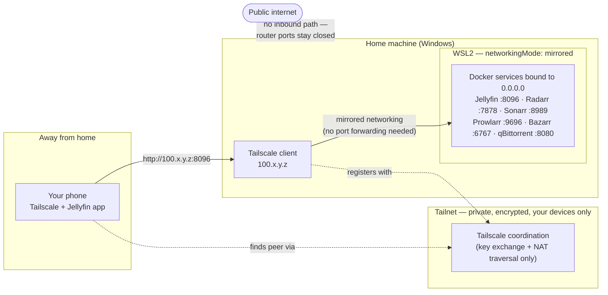
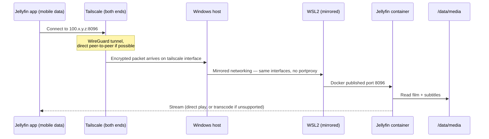

# Remote Access — watching away from home, via Tailscale

By default this stack is reachable only on your own network. This guide adds remote
access using [Tailscale](https://tailscale.com/), so you can watch from anywhere
without exposing anything to the public internet.

For local usage see the [User Guide](USER-GUIDE.md).

## Why Tailscale rather than port forwarding

The obvious approach — forward port 8096 on your router — puts your Jellyfin login
page on the public internet, where it will be found and brute-forced by automated
scanners within days. Given the passwords currently in use (see below), that is not an
acceptable option.

Tailscale instead builds a private encrypted mesh network ("tailnet") between *your
own devices*. Each device gets a stable `100.x.y.z` address that only other devices
signed into your tailnet can reach. Nothing is published publicly, no router
configuration is needed, and it works from behind CGNAT/mobile networks.

> ### Read this before you enable remote access
>
> Every app in this stack currently uses `admin` / `admin123`. That was defensible
> while everything was bound to `localhost` on one machine. Once your server is
> reachable from other devices, the only thing standing between your library and
> anyone who gets onto your tailnet — a shared device, a stolen laptop, a phone you
> lent out — is that password.
>
> **Change the Jellyfin password to something strong before finishing this guide.**
> Jellyfin → **Dashboard → Users → admin → Password**. Then update
> `CREDENTIALS.md`.

## How it works

Your server joins the tailnet once. Every device you want to watch on also joins.
They then talk directly and privately, wherever they are.



Two things to read off the diagram:

- **The coordination server only brokers the connection.** It exchanges keys and helps
  the two devices find each other through NAT. Your video traffic goes **directly**
  phone→home, encrypted end to end; it does not flow through Tailscale's servers.
  (The exception is a `relay` fallback when hole-punching fails — see Troubleshooting.)
- **Nothing is wired per application.** Tailscale gives the *machine* an extra IP.
  Every service already listening on `0.0.0.0` is reachable on it automatically, which
  is why no container, compose file, or reverse proxy needs changing.

### What the request actually traverses



### The mechanics, step by step

**1. Each device gets an identity, not a port.**
Installing Tailscale and signing in registers the machine with your tailnet. It is
issued a stable address from the `100.64.0.0/10` range (this host: `100.126.149.22`)
that belongs to the *machine*, not to any service. The address does not change when
you move networks — the same `100.x` works on home Wi-Fi, mobile data, or a café.

**2. Every service on that machine comes along for free.**
This is the part that surprises people. Tailscale creates a virtual network
interface; anything already listening on `0.0.0.0` is reachable through it
immediately. Jellyfin was bound to `0.0.0.0:8096` before Tailscale existed, so it
became reachable at `100.126.149.22:8096` the moment the machine joined — no config,
no reverse proxy, no per-app step. Verified here: all six web UIs answered on the
tailnet address with no changes to `docker-compose.yml`.

**3. Connections are brokered, then made directly.**
When your phone opens `100.126.149.22:8096`, Tailscale's coordination server helps
the two devices find each other and exchange public keys — then gets out of the way.
The actual tunnel is **WireGuard**, encrypted end-to-end between your phone and your
machine. Your film does not stream through Tailscale's infrastructure.

**4. NAT traversal replaces port forwarding.**
Both devices sit behind NAT, so neither can normally accept an inbound connection.
Tailscale hole-punches: both ends send outbound packets simultaneously, which makes
each router accept the other's traffic. Because both connections are *outbound*, no
router configuration and no open port is required. Where hole-punching fails (strict
carrier-grade NAT), traffic falls back to an encrypted **DERP relay** — slower, still
private, still works.

**5. Access is limited to your own devices.**
There is no public endpoint to discover. A device can only reach the tailnet after
signing into your account, so the exposure is your own device list rather than the
internet. This is the entire security argument for choosing it over forwarding
port 8096.

**6. MagicDNS gives the machine a name.**
Rather than memorising `100.126.149.22`, Tailscale's DNS resolves
`admin-pc.tail9dbb76.ts.net` inside the tailnet. Names survive address changes, so
clients configured with the name keep working.

### Why this works here without any port forwarding

One local detail makes it seamless. Jellyfin runs in Docker **inside WSL2**, which
would normally sit behind its own NAT — traffic arriving on Windows would need
`netsh portproxy` forwarding to reach it.

This WSL instance runs with `networkingMode=mirrored` (see `/etc/wsl.conf`), meaning
WSL shares the Windows host's network interfaces instead of getting a private
subnet. So when Tailscale creates its interface on Windows, the WSL-bound container
ports are already reachable on it. That is why installing Tailscale on Windows
required zero changes on the Linux side.

## Setup

Tailscale runs on the **Windows host**, not inside WSL or as a container. That is the
right place here: it starts as a Windows service independently of WSL, so remote
access does not depend on the Docker stack being up, and thanks to mirrored
networking it reaches the containers with no extra plumbing.

> **Already done on this machine**, installed with
> `winget install --id Tailscale.Tailscale`:
>
> | | |
> |---|---|
> | Machine | `Admin-PC` |
> | Tailnet IP | `100.126.149.22` |
> | MagicDNS | `admin-pc.tail9dbb76.ts.net` |
> | Jellyfin | `http://admin-pc.tail9dbb76.ts.net:8096` |
>
> Verified: all six web UIs answer on the tailnet address with no compose changes, no
> port forwarding and no reverse proxy. MagicDNS is enabled.

### 1. Install and sign in on the server

```powershell
winget install --id Tailscale.Tailscale --accept-package-agreements
```

Then authenticate — this prints a URL to open in a browser:

```powershell
& "C:\Program Files\Tailscale\tailscale.exe" up --unattended
```

The account you sign in with **is** your tailnet; use the same one on every device.
`--unattended` keeps the machine connected without a logged-in user.

Confirm, and note the address:

```powershell
& "C:\Program Files\Tailscale\tailscale.exe" status
```

### 2. Add the devices you want to watch on

Install Tailscale and sign in with **the same account**:

- Android — Play Store · iPhone / iPad / Apple TV — App Store
- Windows / macOS / Linux — https://tailscale.com/download

A different account creates a separate tailnet and nothing will connect. This is the
most common mistake.

### 3. Point Jellyfin clients at the server

```
http://admin-pc.tail9dbb76.ts.net:8096
http://100.126.149.22:8096              (if the name will not resolve)
```

Do **not** use `localhost` — on a phone that means the phone itself. Do not use
`192.168.x.x` either; that only works on your home network.

### 4. Verify it actually works remotely

Turn Wi-Fi **off** on the phone and use mobile data, with Tailscale connected.
Testing on home Wi-Fi proves nothing — it may be succeeding over the LAN.

```
tailscale status                # both devices listed and online?
tailscale ping admin-pc
```

`ping` reporting `direct` means peer-to-peer; `relay` still works, with more latency.


## After a reboot

Nothing needs re-authenticating — Tailscale stores its node key, so the machine
rejoins the tailnet on its own with the same IP and MagicDNS name. You never repeat
the login step.

What actually happens on this host, verified:

| Component | Restarts by itself? | Mechanism |
|---|---|---|
| Tailscale (Windows) | Yes | Windows service, `StartType: Automatic` |
| Docker daemon | Yes | `systemctl is-enabled docker` → `enabled` |
| All containers | Yes | `restart: unless-stopped` in `docker-compose.yml` |
| **WSL2 itself** | **No** | Windows does not start WSL at boot by default |

That last row is the catch. **Docker runs inside WSL**, so if WSL is not running,
none of the services are running either — even though Tailscale is happily online and
the machine appears connected in the admin console. Symptom: the peer shows as
online, but `http://admin-pc.tail9dbb76.ts.net:8096` times out.

### Quick fix — start WSL

Opening any WSL terminal on the Windows machine boots the distro; systemd then starts
Docker, and the containers come back on their own. From PowerShell:

```powershell
wsl.exe -d Ubuntu -u root /bin/true
```

Give it 30–60 seconds, then confirm:

```
docker compose ps
```

### Permanent fix — start WSL automatically at logon

So you never have to think about it, register a scheduled task **once** (run in
PowerShell on Windows):

```powershell
schtasks /create /tn "Start WSL" /tr "wsl.exe -d Ubuntu -u root /bin/true" /sc onlogon /rl highest /f
```

WSL then boots at logon, systemd starts Docker, and the stack is up before you reach
for your phone. Because `systemd=true` is set in `/etc/wsl.conf`, systemd keeps
running as PID 1 and holds the distro open — WSL does not idle out and shut the
containers down.

> Note this triggers **at logon**, not at power-on, so the machine still needs someone
> to log into Windows after a reboot. For a genuinely headless server you would want
> `/sc onstart` with a stored account, or to move the stack off WSL onto a Linux host.

### Checking remotely when something is wrong

If a film will not load while you are out, this ordering tells you where the problem
is:

1. **Tailscale app on the phone** — is the peer listed and online? If not, the Windows
   machine is off or asleep. Nothing else can be diagnosed remotely.
2. **Peer online but Jellyfin times out** — almost always WSL is not running. Requires
   physical or remote-desktop access to the machine to start it.
3. **Jellyfin loads but playback stalls** — bandwidth or transcoding, not the network
   path. See below.

Worth knowing: a sleeping or powered-off machine cannot be woken through Tailscale.
If you want reliable access while away, disable sleep on the host — or at minimum
know that "peer offline" means the PC itself is unavailable.

## Streaming quality when away from home

Remote playback is limited by your **home upload** bandwidth, which on most consumer
connections is far smaller than download. A 4K remux at 60+ Mbps will not stream to a
phone on mobile data.

Two ways to deal with it:

- **Lower the quality in the client.** In the Jellyfin app, set a bitrate cap for
  remote playback (e.g. 4–8 Mbps for 1080p). This makes the server transcode down.
- **Prefer smaller sources.** A 1080p WEB-DL streams comfortably where a 2160p remux
  will not — worth remembering when picking releases.

Note that transcoding is **CPU-only** in this setup: no GPU device is passed into the
Jellyfin container, so every transcode is software. One remote 4K→1080p transcode can
saturate a CPU. If remote watching becomes routine, consider passing through a GPU
(QuickSync/NVENC) — a separate piece of work not covered here.

Check your actual upload speed before blaming the setup:

```
speedtest-cli --simple      # or use fast.com from the server's browser
```

## Security consequence: every app is now reachable

Tailscale attaches to the machine, so **all six web UIs became remotely reachable at
once** — not just Jellyfin. Per-app URLs are in the
[user guide](USER-GUIDE.md#everything-else-is-reachable-too).

That is useful (queue a film from your phone while out, have it waiting when you get
home) but it changes the threat model. Radarr, Sonarr and qBittorrent can write to
your filesystem, their API keys bypass the login entirely, and at time of writing they
share one weak password while Bazarr has no authentication at all.

The tailnet is private to your devices, so this is not an open door — but any device
that joins, or is lent out, stolen, or compromised, gets full control of the stack.
Strengthen the credentials in `CREDENTIALS.md` and set a Bazarr password
(**Settings → General → Security**).

## What not to do

- **Tailscale Funnel** publishes a service to the *entire public internet*. It exists
  for things you intend to be public. Do not put Jellyfin behind it.
- **Router port forwarding** — the thing Tailscale replaces. Once Tailscale works,
  leave port 8096 closed on your router.
- **Sharing your tailnet login.** To give someone else access, use Tailscale's
  device-sharing feature and a separate Jellyfin user account, not your credentials.

## Troubleshooting

Everyday symptoms and fixes are in the
[user guide](USER-GUIDE.md#if-it-does-not-connect). Deeper diagnosis:

```
tailscale status            # peer list, and direct vs relay per peer
tailscale netcheck          # NAT type, DERP latency, hole-punching ability
tailscale ping <machine>    # shows the path actually used
docker compose logs -f jellyfin
```

- **`relay` instead of `direct`** — still works, just higher latency. Neither end
  could hole-punch through its NAT, so traffic goes via an encrypted DERP relay.
  `netcheck` will usually show a hard/symmetric NAT on one side.
- **Jellyfin refuses the connection** — check **Dashboard → Networking**: remote
  access must stay enabled with an empty IP filter (currently `EnableRemoteAccess=True`
  and no filter, which is correct).
- **Peer online but ports time out** — WSL is not running; see
  [after a reboot](#after-a-reboot).
