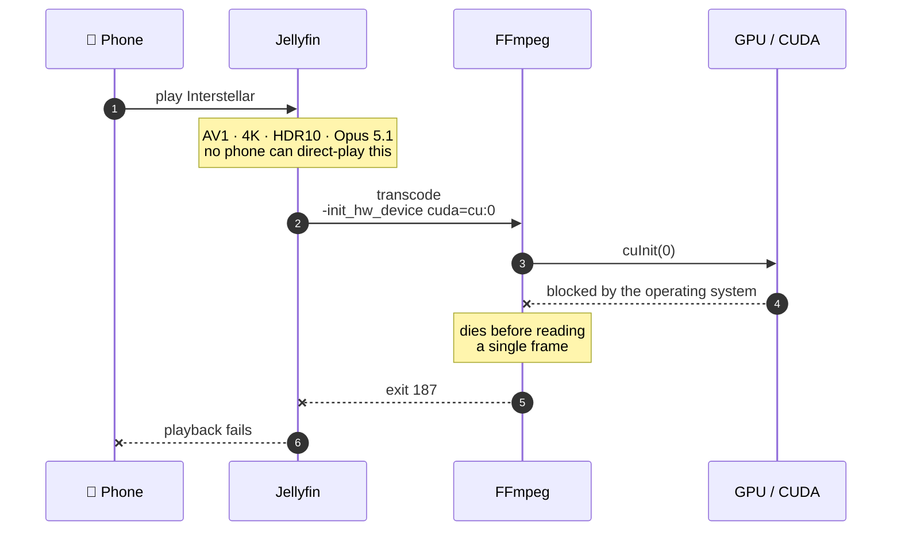
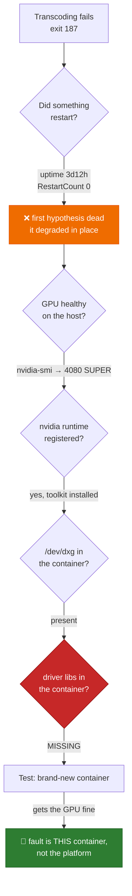
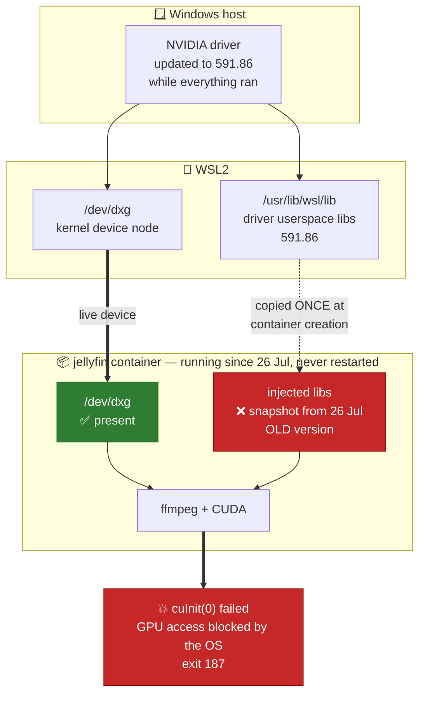
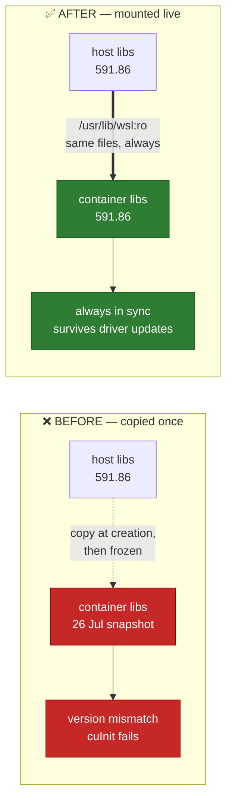

# Postmortem — GPU transcoding outage (2026-07-27 → 2026-07-29)

**Impact:** every Jellyfin playback that required transcoding failed for up to ~2 days.
Direct-play kept working, so the stack looked healthy.
**Root cause:** a Windows NVIDIA driver update moved out from under a long-running
container, leaving it with stale driver libraries injected at creation time.
**Fix:** mount `/usr/lib/wsl` read-only into the Jellyfin container and recreate it.
**Status:** resolved and verified — but see
[Follow-on](#follow-on-a-second-failure-mode-2026-07-30). The fix prevents *this*
failure mode, not every way the GPU chain can break.

> **Correction.** This report describes the cause as *stale libraries pinned at container
> creation*. That is the documented toolkit behaviour, but the **observed** fact was that
> `/usr/lib/wsl/lib` was **missing** inside the container, not merely old — "stale" was an
> inference stated with more confidence than the evidence carried. The distinction
> matters diagnostically: absent libraries give *"GPU access blocked by the operating
> system"*, mismatched ones give *"Cannot load libcuda.so.1"*, and each points at a
> different layer. See the
> [2026-07-30 postmortem](2026-07-30-wsl-driver-libs-stale.md#correcting-the-first-postmortem).

---

## What broke, from the user's side

A phone could not play *Interstellar*. Nothing else was obviously wrong: the stack was
up, Jellyfin answered, the library was intact, other titles played.

That partial-failure shape is what made this slow to spot. The stack has 7 containers
and all of them were `Up`; the fault sat one layer below, in a code path only some
playbacks take.

## Timeline

| When | Event |
|---|---|
| 2026-07-26 13:53 | WSL boots. `docker`, `containerd`, `tailscaled` start. Jellyfin container starts. |
| 2026-07-27 | Post-reboot health check: `docker exec jellyfin nvidia-smi` returns `NVIDIA GeForce RTX 4080 SUPER`. **GPU confirmed working.** |
| 2026-07-27 → 07-29 | Windows updates the NVIDIA driver (host ends at `591.86`). The container keeps running — no restart, no alert. |
| 2026-07-29 23:35–23:36 | Playback attempts. FFmpeg dies three times in six seconds. |
| 2026-07-29 23:37:47 | `Playback stopped reported by app Jellyfin Web 10.11.11 playing Interstellar.` |
| 2026-07-29 (later) | Reported as "why can't I stream Interstellar to my phone". Diagnosed and fixed. |

Detection was **entirely user-driven**. Nothing in the stack raised a warning — see
[Gaps](#gaps-that-let-this-run-for-days).

## Symptoms

Jellyfin's transcode log:

```
[AVHWDeviceContext @ 0x…] cu->cuInit(0) failed
Device creation failed: -542398533.
Failed to set value 'cuda=cu:0' for option 'init_hw_device': Generic error in an external library
Error parsing global options: Generic error in an external library
```

Jellyfin's application log:

```
MediaBrowser.Common.FfmpegException: FFmpeg exited with code 187
[ERR] Jellyfin.Api.Middleware.ExceptionMiddleware: Error processing request.
      URL GET /videos/…/hls1/main/-1.mp4
```

Inside the container:

```
$ docker exec jellyfin nvidia-smi
Failed to initialize NVML: GPU access blocked by the operating system
```

The wording matters. **"Blocked by the operating system"** is not "no device found" —
the GPU was visible, but the userspace libraries could not talk to it.

## Why this title, and why the phone

*Interstellar* is stored as:

```
video : AV1, 3840x2160, 10-bit HDR10 (yuv420p10le)
audio : Opus 5.1  x5 tracks
subs  : PGS (bitmap)
size  : 18.1 GB
```

No phone can direct-play that combination, so Jellyfin had to build a full GPU
pipeline — AV1 decode, HDR→SDR tonemap, HEVC encode:

```
-init_hw_device cuda=cu:0 -filter_hw_device cu -hwaccel cuda
-codec:v:0 hevc_nvenc -preset p5 -b:v 17144280
-vf "…,tonemap_cuda=format=yuv420p:p=bt709:t=bt709:m=bt709:tonemap=bt2390:peak=100:desat=0"
```

Every one of those stages needs CUDA. The request died at `init_hw_device`, before a
single frame was read:



This title was the **messenger, not the cause**. Any transcode was failing; this file
merely guaranteed one.

## Investigation, including the wrong turn

The first hypothesis was: *"Docker restarted without the NVIDIA runtime"* — the
failure mode already documented in the `start-media-stack` skill, and the obvious
guess. **It was wrong**, and the uptime data disproved it:

```
WSL boot         : 2026-07-26 13:53   (uptime 3d 12h)
docker daemon    : 2026-07-26 13:53
jellyfin started : 2026-07-26 06:53 UTC = 13:53 local
RestartCount     : 0
```

Nothing had restarted. The container holding a working GPU on Jul 27 was the *same
process* still running on Jul 29. It had degraded in place — a possibility the initial
hypothesis did not allow for.

Narrowing down, layer by layer:

```
host nvidia-smi          : RTX 4080 SUPER, driver 591.86     ✅ GPU healthy
docker runtimes          : runc, io.containerd.runc.v2, nvidia ✅ registered
nvidia-container-toolkit : present on PATH                    ✅ installed
/dev/dxg  (host)         : present                            ✅
/dev/dxg  (container)    : present                            ✅ device passed through
/usr/lib/wsl/lib (container): No such file or directory        ❌ THE GAP
```

`/dev/dxg` is how WSL2 exposes the GPU, and it was fine. What had gone missing was the
**userspace half** — the driver libraries CUDA links against.

The decisive test was a brand-new container:

```bash
docker run --rm --gpus all -v /usr/lib/wsl:/usr/lib/wsl \
  nvidia/cuda:12.4.0-base-ubuntu22.04 nvidia-smi --query-gpu=name --format=csv,noheader
→ NVIDIA GeForce RTX 4080 SUPER
```

A fresh container got the GPU immediately. That isolated the fault to the *long-running
Jellyfin container specifically*, and ruled out the driver, WSL, Docker, and the toolkit
in one step.



Each step removed a whole layer from suspicion. The final test was the cheapest and most
decisive: one `docker run` split *"the platform is broken"* from *"this container is
broken"*.

## Root cause

The NVIDIA Container Toolkit injects the WSL GPU driver libraries into a container
**once, at creation time**. Those copies are pinned to whatever driver was installed at
that moment.

When Windows updates the GPU driver underneath a running container:

- the **host** libraries advance to the new version
- the **container** keeps its snapshot from creation day
- the kernel-side driver no longer matches the container's userspace libraries
- CUDA initialisation fails: `cuInit(0) failed`, NVML reports "blocked by the OS"

No restart is involved, which is precisely why this is easy to misdiagnose. From
inside the container nothing changed; the world changed around it.



The device node stayed correct the whole time — only the **userspace half** drifted out
of sync. That asymmetry is why the error said *blocked*, not *not found*.

### Contributing factors

1. **Long-lived containers.** Everything runs `restart: unless-stopped` and is designed
   to survive for weeks. The longer a container lives, the more likely a host driver
   update crosses it. This is the direct trade-off for a stable stack.
2. **Snapshot semantics were invisible.** Nothing in the compose file hinted that GPU
   support was a one-time copy rather than a live binding.
3. **Silent, partial failure.** Direct-play was unaffected, so the library, the apps and
   every container health check stayed green.

## Resolution

Mount the host's WSL driver libraries read-only, so the container reads them live
instead of holding a snapshot:



The change, in `docker-compose.yml` (jellyfin service):

```yaml
volumes:
  - ${CONFIG_ROOT}/jellyfin:/config
  - ${DATA_ROOT}/media:/data/media
  # WSL2 GPU driver libs, read live from the host. Without this the NVIDIA
  # toolkit copies them in once at creation, and a later Windows driver
  # update leaves the container stale -> "GPU access blocked by the OS".
  - /usr/lib/wsl:/usr/lib/wsl:ro
```

Then recreate:

```bash
docker compose up -d --force-recreate jellyfin
```

### Verification

Confirmed against the exact operation that had been failing, not just `nvidia-smi`:

```
GPU in container : NVIDIA GeForce RTX 4080 SUPER, 591.86      ✅
WSL driver libs  : libcuda.so, libcuda.so.1, libd3d12.so, …   ✅ now mounted
CUDA init + NVENC: exit 0                                     ✅ was exit 187
tonemap_cuda     : available                                  ✅ HDR10 path
av1_cuvid        : available                                  ✅ AV1 decode
jellyfin         : Up, HTTP 302
```

The CUDA/NVENC check ran the failing pipeline directly:

```bash
docker exec jellyfin /usr/lib/jellyfin-ffmpeg/ffmpeg -hide_banner -loglevel error \
  -init_hw_device cuda=cu:0 -filter_hw_device cu \
  -f lavfi -i testsrc=size=1280x720:rate=30 -t 1 \
  -c:v hevc_nvenc -preset p5 -f null -
```

Shipped in `64c8d15`.

## Follow-on: a second failure mode (2026-07-30)

The day after this fix shipped, GPU transcoding broke again — **differently**, and in a
way the fix could not prevent. Recorded here because it materially narrows what the
resolution above actually buys.

Windows installed another driver update at 00:55. This time **WSL itself** was left
holding stale libraries:

```
Windows driver store updated : 2026-07-30 00:55
WSL /usr/lib/wsl/lib         : 2026-07-22 14:08   (8 days stale)

host nvidia-smi              : exit 139 (SIGSEGV)
container CUDA               : Cannot load libcuda.so.1
/dev/dxg                     : present
```

`/usr/lib/wsl/lib` is an overlay WSL assembles at boot from the Windows driver store. It
does not rebuild while WSL runs, and this instance had been up 3½ days.

**What the mount does and does not guarantee:**

| Failure mode | Prevented? |
|---|---|
| Container drifts stale while the host is fine — *this incident* | ✅ Yes. Host and container now share the same inode and cannot diverge |
| WSL itself goes stale after a Windows driver update | ❌ No. The container faithfully mirrors a host that is already wrong |

The mount makes the container inherit the host's state exactly. That is correct
behaviour — but if the host is broken, so is the container.

**Fix for this variant**, from Windows: `wsl --shutdown`, then reopen WSL. That rebuilds
the overlay from the current driver.

Telling them apart takes one command: if `nvidia-smi` fails **on the host** it is this
variant; if it succeeds on the host but fails inside the container it is the original.
Full detail in [`GPU-WSL-PASSTHROUGH.md`](../technical/GPU-WSL-PASSTHROUGH.md).

Expect recurrence — Windows updates drivers silently and the containers are deliberately
long-lived. The goal is recognition, not prevention.

## Gaps that let this run for days

- **No transcode health check.** The stack verifies containers are `Up` and that
  `nvidia-smi` works *at startup*, but never re-checks. This fault appeared mid-run,
  where nothing was looking.
- **FFmpeg exit 187 raised no alert.** It failed three times in six seconds and only a
  human noticed, hours later.
- **The startup check is the wrong shape.** `nvidia-smi` returning a GPU name does not
  prove CUDA can initialise. The one-second `hevc_nvenc` encode above does, and is a
  strictly better probe.

## Recommended follow-ups

1. **Swap the skill's GPU probe** in `start-media-stack` step 4 from `nvidia-smi` to the
   CUDA-init + NVENC encode test — it exercises the path that actually breaks.
2. **Re-check periodically, not just at boot**, since this class of fault appears
   mid-run without a restart.
3. **Alert on `FFmpeg exited with code 187`** in the Jellyfin log — an unambiguous
   signature of a broken hardware pipeline.
4. **Consider a mobile-friendly copy** of 4K AV1 HDR titles. Even with the GPU healthy,
   Jellyfin targeted 17 Mbps for a phone stream, which will struggle on cellular. A 4K
   AV1 HDR remux is a TV-on-LAN file.

## Lessons

- **"Nothing restarted" is not "nothing changed."** A container is not sealed off from
  its host; the platform beneath it can move while it runs. Uptime and `RestartCount`
  were what falsified the first hypothesis — check them before acting on it.
- **Read the error's exact wording.** "GPU access blocked by the operating system" is a
  permissions/linkage failure, not an absence — it pointed at userspace libraries, not
  at device passthrough.
- **Bisect with a fresh instance.** One `docker run` separated "the platform is broken"
  from "this container is broken" and collapsed the search space immediately.
- **Anything injected at creation has snapshot semantics.** If the host can update it
  independently, mount it instead of copying it in.
