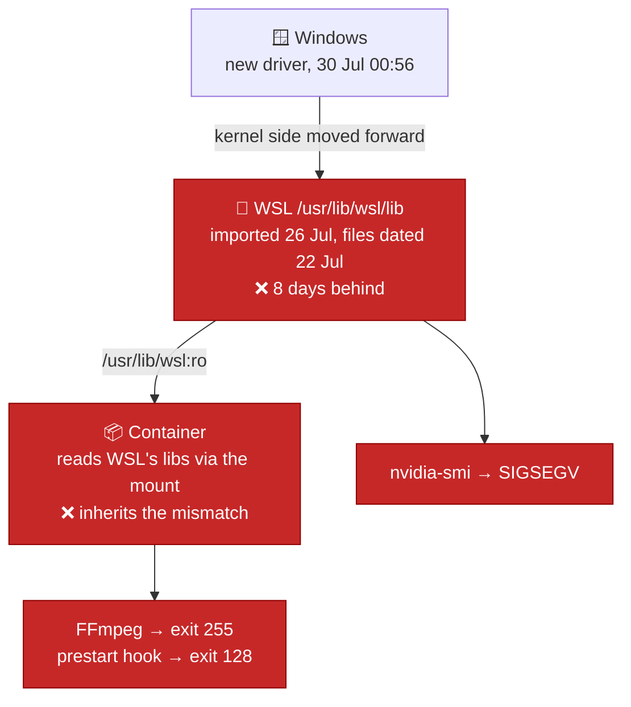
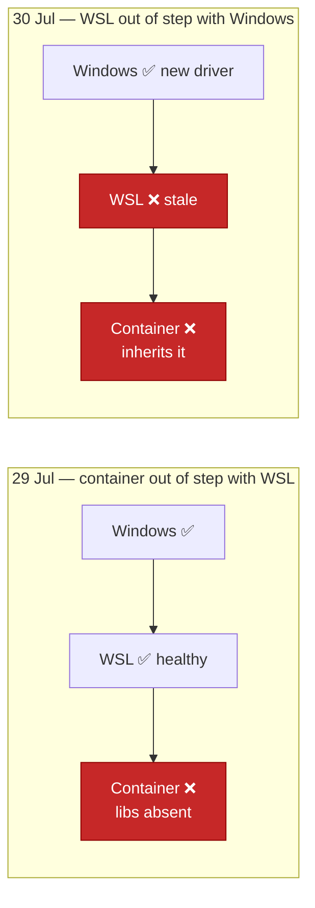

# Postmortem — WSL driver libraries stale after a Windows GPU update (2026-07-30)

**Impact:** all GPU transcoding down. After a stack restart, **Jellyfin would not start
at all** — escalating from degraded to fully offline.
**Root cause:** Windows installed a new GPU driver while WSL was running. WSL only
imports driver libraries at VM boot, so its set stayed 8 days behind the kernel driver.
**Fix:** `wsl --shutdown` from Windows, then reopen WSL.
**Status:** 🔴 **OPEN** — awaiting the WSL restart. Six of seven services running;
Jellyfin down.

This is the second GPU outage in two days. The first
([2026-07-29](2026-07-29-jellyfin-gpu-transcode-outage.md)) was a *different pair of
layers* falling out of step — see [Comparison](#comparison-of-the-two-incidents).

---

## What broke

Initially: no film would play on mobile. Not one title — every one, because the library
is largely 4K and a phone always triggers a downscale.

Then, after restarting the stack to try to clear it, Jellyfin stopped starting entirely.
Direct-play stopped working too, because there was no server left to serve it.

## Timeline

| When | Event |
|---|---|
| 2026-07-26 13:53 | WSL boots and imports driver libraries — files dated **2026-07-22**, matching the driver installed then |
| 2026-07-29 | [Incident 1](2026-07-29-jellyfin-gpu-transcode-outage.md) fixed. GPU verified working in the container |
| 2026-07-30 00:55–00:56 | **Windows installs a new GPU driver.** WSL keeps serving its 22 July set |
| 2026-07-30 ~01:0x | Host `nvidia-smi` found segfaulting during a routine verification |
| 2026-07-30 01:39 | Playback attempts fail — 42 transcodes exit 255 |
| 2026-07-30 | Driver updated again manually — **no effect**, WSL libraries unchanged |
| 2026-07-30 | `docker compose restart` → Jellyfin fails to start. **Impact escalates** |
| — | Awaiting `wsl --shutdown` |

Detection was again user-driven, this time via *"why can't I watch any film on mobile?"*

## Symptoms

Host — `nvidia-smi` does not error, it **crashes**:

```
exit 139  (SIGSEGV — "dumped core")
```

Container — FFmpeg cannot load the library at all:

```
[AVHWDeviceContext] Cannot load libcuda.so.1
[AVHWDeviceContext] Could not dynamically load CUDA
Device creation failed: -1.
Failed to set value 'cuda=cu:0' for option 'init_hw_device': Operation not permitted
```

```
FFmpeg exited with code 255 : 42 occurrences
FFmpeg exited with code 0   :  1
```

After the stack restart, Jellyfin could not even be created — the NVIDIA runtime hook
segfaults *before* container init:

```
status=exited  exit=128
error running prestart hook #0: SIGSEGV: segmentation violation
  go-nvml/pkg/dl._Cfunc_dlopen
  → assertHasLibrary → HasNvml → ResolvePlatform
```

The evidence that names the cause:

```
WSL /usr/lib/wsl/lib/libcuda.so.1 : 2026-07-22 14:08
Windows driver store              : 2026-07-30 00:56
/dev/dxg                          : present
```

Every file exists. Only the **versions** disagree.

## Root cause

`/usr/lib/wsl/lib` is an overlay WSL assembles **at VM boot** from the Windows driver
store:

```
overlay  lowerdir=/gpu_lib_packaged:/gpu_lib_inbox  upperdir=/gpu_lib/rw/upper
```

It is never rebuilt while WSL runs. This instance had been up 3½ days, so when Windows
replaced the driver at 00:56 the kernel-side interface moved forward while WSL's
userspace libraries stayed on 22 July. `libcuda.so.1` can no longer talk to the driver
it was built against, and every consumer — `nvidia-smi`, FFmpeg, and the container
toolkit's prestart hook — segfaults trying.



### Contributing factors

1. **WSL imports driver libraries only at VM boot.** No live refresh mechanism exists.
   This is a WSL limitation, not a misconfiguration.
2. **Automatic Windows driver updates** land without warning, at any time.
3. **Long uptime is the design.** Containers run `unless-stopped` and WSL is started by
   hand and left running — the longer it runs, the likelier an update crosses it.
4. **Updating the driver again made it worse, not better.** Each new driver widens the
   gap; only a WSL restart closes it.
5. **The GPU reservation makes Jellyfin fail closed.** A broken GPU should degrade
   transcoding; instead the prestart hook crashes and the container cannot start, taking
   direct-play down with it.

### What escalated it

Restarting the stack while the GPU was broken turned *"transcoding fails"* into
*"Jellyfin is gone"*. The container had been running since before the driver update and
survived only because it was never asked to re-create. Restarting forced it through the
prestart hook, which crashes.

**Do not restart the stack to clear a GPU fault.** Restart WSL instead.

## Resolution

From **Windows** PowerShell or CMD — not the WSL terminal:

```powershell
wsl --shutdown
```

Then reopen WSL. The overlay is rebuilt from the current driver, and the container
inherits the fresh set through the `/usr/lib/wsl` mount.

### Verification once back

```bash
nvidia-smi                       # expect: NVIDIA GeForce RTX 4080 SUPER
docker exec jellyfin nvidia-smi  # expect: the same

docker exec jellyfin /usr/lib/jellyfin-ffmpeg/ffmpeg -hide_banner -loglevel error \
  -init_hw_device cuda=cu:0 -f lavfi -i testsrc=size=640x360:rate=30 -t 1 \
  -c:v hevc_nvenc -f null - && echo "GPU OK"
```

## Comparison of the two incidents

Same symptom class, different layers, different fixes:



| | **2026-07-29** | **2026-07-30** |
|---|---|---|
| **Layers out of step** | Container vs WSL | WSL vs Windows |
| **What was observed** | `/usr/lib/wsl/lib` **absent** inside the container | Libraries present everywhere, **versions mismatched** |
| **Host `nvidia-smi`** | ✅ worked — RTX 4080 SUPER | ❌ SIGSEGV, exit 139 |
| **Container `nvidia-smi`** | ❌ "GPU access blocked by the operating system" | ❌ no output |
| **FFmpeg error** | `cuInit(0) failed`, `Device creation failed: -542398533` | `Cannot load libcuda.so.1`, `Device creation failed: -1` |
| **FFmpeg exit code** | `187` | `255` |
| **Jellyfin container** | Ran fine, only transcoding failed | Ran, then **could not start** after a restart |
| **Fresh container test** | ✅ got the GPU — isolated fault to that container | ❌ would also fail — the platform itself is broken |
| **Trigger** | Host library set changed after container creation | Windows driver update at 00:56 |
| **Detection** | User report, ~2 days later | User report, same day |
| **Fix** | `docker compose up -d --force-recreate jellyfin` | `wsl --shutdown` from Windows |
| **Prevented by the `/usr/lib/wsl` mount?** | ✅ Yes — cannot recur | ❌ No — container faithfully inherits a broken host |
| **Impact** | Transcoding only; direct-play fine | Transcoding, then **all** playback once Jellyfin died |

### The one-line discriminator

```bash
nvidia-smi   # on the WSL host
```

- **Works** → the fault is below it: container problem (29 Jul shape)
- **Crashes or empty** → the fault is at the host: WSL problem (30 Jul shape)

That single command picks the fix. Full detail in
[`GPU-WSL-PASSTHROUGH.md`](../technical/GPU-WSL-PASSTHROUGH.md).

## Correcting the first postmortem

The 29 July write-up described that incident as *stale libraries pinned at container
creation*. The documented toolkit behaviour supports that mechanism, but the **observed**
fact was that `/usr/lib/wsl/lib` was **missing** from the container, not old. "Stale" was
an inference presented with more confidence than the evidence carried.

The distinction matters when diagnosing: *absent* libraries and *mismatched* libraries
produce different errors — "blocked by the operating system" versus "cannot load
libcuda.so.1" — and the difference points at which layer to fix.

## Recommended follow-ups

1. **Make GPU driver updates manual** — NVIDIA App → disable automatic downloads; Windows
   Update → Optional updates. Then reboot Windows (or `wsl --shutdown`) straight after
   installing. This is the only measure that *prevents* rather than reacts. **Open.**
2. **Add `scripts/check-gpu.sh`** running the real CUDA probe, wired into the
   `start-media-stack` skill so it runs at every startup. Both outages went undetected
   because nothing re-checked after boot. **Open.**
3. **Add a no-GPU fallback** — a `docker-compose.override.yml` dropping the device
   reservation, so a broken GPU degrades to CPU transcoding instead of taking Jellyfin
   offline. **Open.**
4. **Document the update routine** in `QUICKSTART.md`: install driver → restart WSL →
   verify. **Open.**

## Lessons

- **Restarting containers can escalate a host-level fault.** A container that has been
  running since before the breakage may keep working precisely because it is never
  re-created. Restarting forces it through initialisation that now fails. Diagnose the
  layer first.
- **Updating the driver again is not a fix.** It widens the gap. Only the layer that
  imports it can close it, and it imports only at boot.
- **The same symptom can come from either direction.** "Transcoding is broken" pointed at
  the container one day and at WSL the next. One command on the host tells them apart.
- **A fix that works as designed can still leave you exposed.** The `/usr/lib/wsl` mount
  did exactly its job — and that job is to make the container mirror the host, including
  when the host is wrong.
