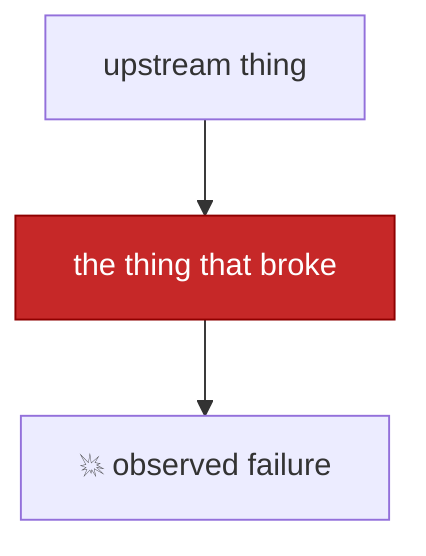

# Postmortem — <short title> (<YYYY-MM-DD>)

**Impact:** who or what was affected, and for how long.
**Root cause:** one sentence. The actual cause, not the trigger.
**Fix:** what was changed.
**Status:** resolved / mitigated / open.

---

## What broke, from the user's side

The symptom as it was experienced, before anyone knew the cause. Include what still
worked — partial failures are the ones that hide longest.

## Timeline

| When | Event |
|---|---|
| YYYY-MM-DD HH:MM | Last known-good state, with the evidence for it |
| YYYY-MM-DD HH:MM | The change that caused it, if identifiable |
| YYYY-MM-DD HH:MM | First failure |
| YYYY-MM-DD HH:MM | Detected — say how: user report, alert, or noticed by chance |
| YYYY-MM-DD HH:MM | Diagnosed / fixed |

State plainly whether detection was automatic or a person noticing.

## Symptoms

Real log lines and command output. Exact wording matters — quote it.

```
paste the actual error here
```

Call out anything in the message that turned out to be a clue.

## Investigation

Include the wrong turns. Show which hypothesis was tried, what evidence killed it, and
what that ruled out. A report that only shows the correct path teaches nothing about
avoiding the incorrect one.

```
layer 1 : ok
layer 2 : ok
layer 3 : THE GAP
```

If a single cheap test collapsed the search space, highlight it — that is the reusable
technique.

## Root cause

The mechanism, in enough detail that someone unfamiliar could explain it back. Separate
it clearly from the trigger.



### Contributing factors

1. Design decisions that made this possible or likely
2. Anything that delayed detection

## Resolution

What changed, with the diff or config. Show before/after if it aids understanding.

### Verification

Prove the *failing operation* now works — not merely that the service is up. A green
health check that never exercised the broken path proves nothing.

```
before : <failure>
after  : <success>
```

## Gaps that let this run undetected

Why nobody knew sooner. Be specific about which check should have caught it and did not.

## Recommended follow-ups

1. Concrete, actionable items — each one someone could pick up
2. Mark which are done vs still open

## Lessons

Transferable takeaways, not restatements of the fix. What would make the *next*
unfamiliar failure faster to diagnose?
