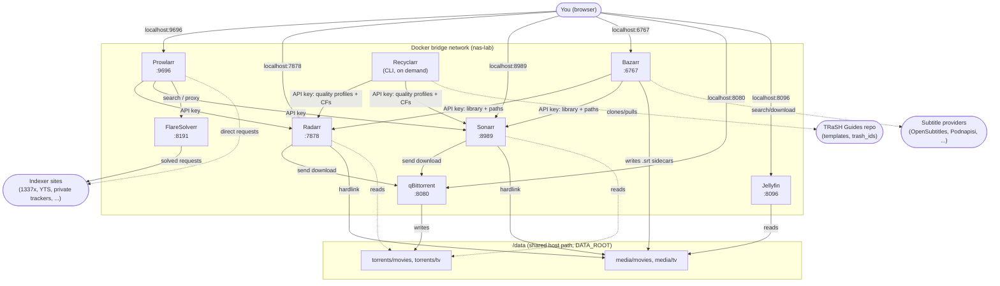
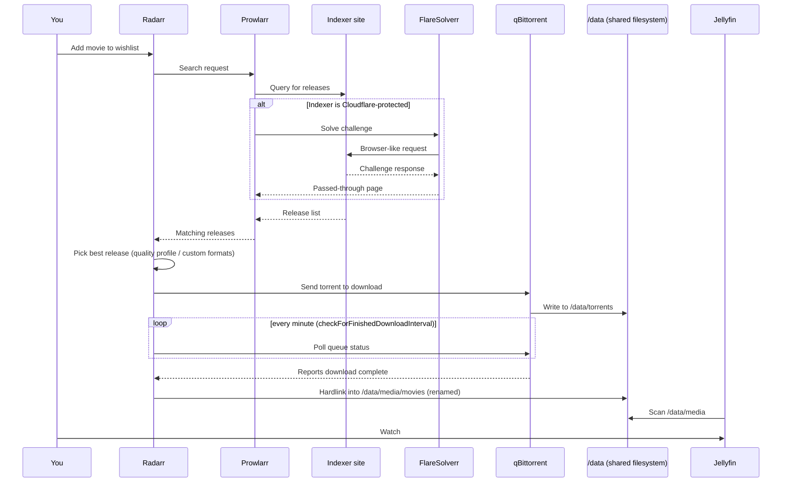

# Technical Architecture

This document explains how the pieces of this stack connect and why, in more
depth than the README's quick summary. See the [README](../../README.md) for
setup steps.

## Components

| Service      | Image                                    | Role                                             |
|--------------|-------------------------------------------|---------------------------------------------------|
| Prowlarr     | `lscr.io/linuxserver/prowlarr`            | Indexer manager — searches trackers, feeds results to Radarr/Sonarr |
| Radarr       | `lscr.io/linuxserver/radarr`              | Movie automation — wishlist, quality selection, import |
| Sonarr       | `lscr.io/linuxserver/sonarr`              | TV automation — same role as Radarr, for shows |
| Bazarr       | `lscr.io/linuxserver/bazarr`              | Subtitle automation — watches Radarr/Sonarr, writes `.srt` sidecars |
| qBittorrent  | `lscr.io/linuxserver/qbittorrent`         | Download client — fetches the actual file via BitTorrent |
| FlareSolverr | `ghcr.io/flaresolverr/flaresolverr`       | Headless-browser proxy — solves Cloudflare challenges for indexers that need it |
| Jellyfin     | `lscr.io/linuxserver/jellyfin`            | Media server — serves the organized library for playback |
| Recyclarr    | `ghcr.io/recyclarr/recyclarr:8`           | Run-to-completion CLI — pushes TRaSH quality profiles/custom formats into Radarr/Sonarr |

Recyclarr is the one service that is not long-running: it has `restart: "no"` and is
invoked on demand (`docker compose run --rm recyclarr sync`), does its work against
the Radarr/Sonarr APIs, then exits. It has no web UI and no published port.

The proposed `vn-dub` movie workflow is intentionally not listed as a component
yet because it has not been deployed. Its reviewed scheduler, worker and Jellyfin
audio-sidecar design is in the
[Vietnamese AI dubbing proposals](../vietnamese-ai-dubbing.md/proposals.md).

## Component diagram



## Request lifecycle



## Networking model

`docker compose` creates one private bridge network for this stack. Every
container gets a DNS name equal to its service name (`radarr`, `sonarr`,
`prowlarr`, `qbittorrent`, `flaresolverr`, `jellyfin`).

- **Container → container** traffic (Prowlarr pushing config into Radarr,
  Radarr sending a job to qBittorrent, an indexer proxying through
  FlareSolverr) uses those service names, e.g. `http://radarr:7878`.
- **You → container** traffic (opening a web UI in your browser) uses
  `http://localhost:<port>`, because your browser runs outside Docker
  entirely — `localhost` there means your WSL/host machine, and the
  `ports:` mapping in `docker-compose.yml` is what exposes each container's
  port onto that host.
- Inside a container, `localhost` means "this container" — it can never
  reach a sibling container that way. This is the most common source of
  "can't connect" mistakes when wiring apps together.

## Storage model: why hardlinks instead of copies

All of Radarr, Sonarr, and qBittorrent mount the **same host directory**
(`DATA_ROOT`, e.g. `/mnt/f/film-data`) at `/data` inside each container:

```
/mnt/f/film-data          (host)
├── media/
│   ├── movies/
│   └── tv/
└── torrents/
    ├── movies/
    └── tv/
```

A hardlink is a second directory entry pointing at the same underlying data
on disk — not a copy. Creating one is instant regardless of file size, and
uses zero additional storage. This only works when source and destination
are on the **same filesystem** — which is why every app shares one root
instead of separate per-app volumes. If Radarr's `/data` and qBittorrent's
`/data` were different host paths, Radarr would be forced to *copy* the file
instead (slow, doubles disk usage), or the import would fail outright.

When a download finishes, Radarr/Sonarr hardlink the file from
`/data/torrents/...` into `/data/media/...` (with a clean filename), while
qBittorrent keeps seeding the original path — both entries are the same
bytes on disk.

## Identity and permissions: PUID / PGID / TZ

linuxserver.io images run their internal application as a specific
Linux UID/GID rather than root, controlled by the `PUID`/`PGID` environment
variables. This repo sets both to `1000` (matched to the host user via
`id -u`/`id -g`) so that any file these containers write into `/data`
(downloads, renamed/hardlinked media) is owned by your normal user on the
host — not root — meaning you can browse, move, or delete it outside Docker
without permission errors. `TZ` affects log timestamps and any
time-based scheduling inside each app (e.g. Radarr's periodic RSS sync),
keeping them aligned to local time instead of UTC.

## Authentication between apps

Each app exposes an HTTP API protected by an API key (found in
`Settings → General → Security` in its own UI, or in its `config.xml` on
disk). When Prowlarr "connects" to Radarr, it is calling Radarr's API using
that key — functionally identical to a script or curl command doing the
same thing. There's no special protocol beyond authenticated HTTP.

## Why FlareSolverr exists

Some indexer sites front themselves with Cloudflare's bot-detection, which
inspects the TLS handshake/fingerprint of incoming connections and resets
ones that don't look like a real browser — Prowlarr's plain HTTP client gets
flagged this way on sites like 1337x. This looks like a network failure
(`Connection reset by peer`) but is actually a deliberate block. FlareSolverr
runs an actual headless Chromium browser in its own container; Prowlarr routes
requests for flagged indexers through it (`Settings → Indexer Proxies`), and
FlareSolverr's browser passes the challenge and returns the real page.

## Release selection, and the limits of custom formats

Radarr/Sonarr choose what to grab by scoring each candidate release against the
quality profile's **custom formats** (synced from TRaSH by Recyclarr). Crucially,
custom formats match on the **release title text**, not on the file's actual
contents — the release hasn't been downloaded yet, so the title is all there is
to judge by.

That has a consequence worth internalizing: an unwanted release whose *title*
looks legitimate passes scoring and gets grabbed. The concrete case seen here was
a raw Blu-ray disc dump (`BDMV/STREAM/*.m2ts` tree) whose title read like a normal
encode; TRaSH's **BR-DISK** format scores `-10000` and the profile's
`minFormatScore` is `0`, so it *would* have been rejected had the title admitted
what it was. Import failed only after the bytes were on disk.

## Failure handling: what is automatic and what is not

Radarr's download-client config (`/api/v3/config/downloadclient`) governs recovery:

| Setting | Value | Effect |
|---|---|---|
| `enableCompletedDownloadHandling` | `true` | Finished downloads are imported automatically |
| `checkForFinishedDownloadInterval` | `1` (min) | How often the queue is polled |
| `autoRedownloadFailed` | `true` | A **failed** download is blocklisted and replaced automatically |
| `rssSyncInterval` | `30` (min) | Periodic re-check of indexers for monitored items |

The gap is the distinction between *failed* and *stalled*. `autoRedownloadFailed`
fires when the download client reports failure — a corrupt download, or an import
error like the disc-dump case, which is why several replacement grabs chained
automatically without intervention. But a torrent sitting at 0% in `metaDL` with
no reachable peers is never reported as failed; it is simply never finished. No
timeout reclassifies it, so it occupies the queue indefinitely until removed by
hand (**Blocklist and Search**).

## Why download speed is a sourcing problem, not a config problem

With DHT, PeX and LSD enabled, no rate limits, and a reachable listening port,
throughput is bounded by how many seeders the *chosen release* has. Public
trackers seed well only while a release is topical, then decay — which is how a
grab can be technically valid yet effectively undownloadable (0 seeds, or 3 seeds
at a few hundred KB/s). Two levers actually move this:

1. **More indexers** — a deeper candidate pool means a better chance the
   best-scoring release is also well-seeded.
2. **Private trackers** — enforced seeding ratios keep releases alive for years,
   which is a structural fix rather than a probabilistic one.

Supplementing new torrents with a curated public-tracker list (qBittorrent
**Options → BitTorrent → automatically add these trackers**) helps releases whose
embedded tracker list is thin, but it cannot manufacture seeders that do not exist.

## Known environment quirk: IPv6

In this WSL2 setup, containers can resolve IPv6 addresses via DNS, but there
is no real IPv6 route out — attempting one fails fast without a proper
network-unreachable signal in some cases, and .NET's HTTP client (used by
Prowlarr/Radarr/Sonarr) doesn't always fall back to IPv4 fast enough, which
surfaces as a generic DNS/SSL error. Fixed by setting
`sysctls: net.ipv6.conf.all.disable_ipv6=1` on the affected containers in
`docker-compose.yml`, so the OS reports no IPv6 capability at all and the
app only ever attempts IPv4.
