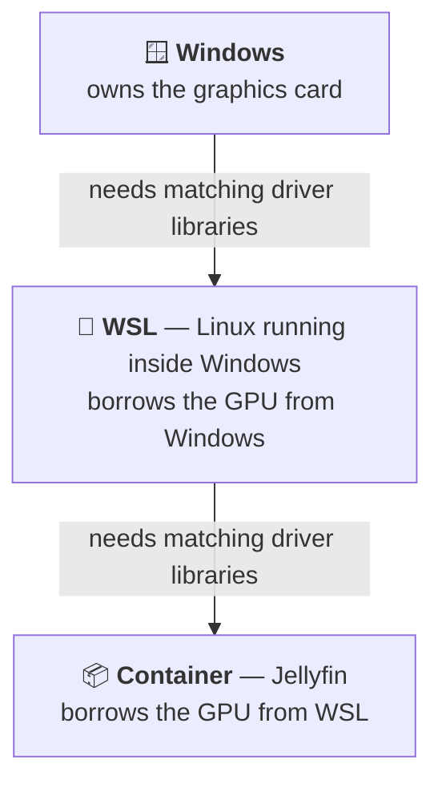
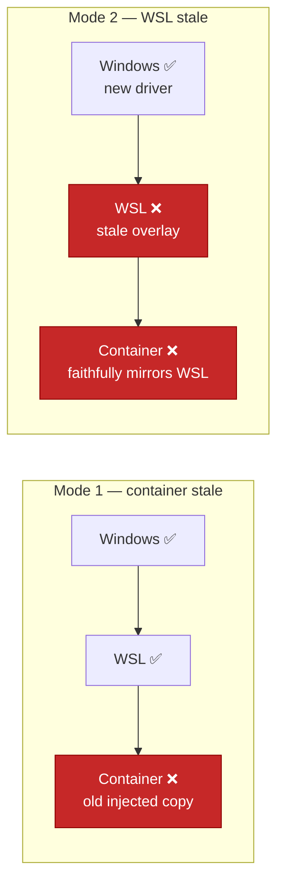

# How the GPU reaches Jellyfin — and the two ways it breaks

Jellyfin's hardware transcoding depends on a chain that crosses three systems. When it
breaks, nothing crashes and nothing looks wrong — most of the library keeps playing
perfectly. This page explains the chain in plain terms, so the failure is recognisable
in seconds rather than hours.

Both failure modes described here have actually happened on this system, a day apart.

## The three layers



The graphics card physically belongs to Windows. For Jellyfin — two layers up — to use
it, **each layer needs its own copy of the driver's userspace libraries, and all three
must be the same version.** Mismatched versions mean the layers cannot talk to each
other, even though the hardware is perfectly healthy.

Concretely, those libraries live at `/usr/lib/wsl/lib` (`libcuda.so.1`, `libnvcuvid.so`,
`libdxcore.so`, …), and the kernel-side device is `/dev/dxg`.

## What goes wrong

**Windows updates its graphics driver.** This is routine, silent, and happens via
Windows Update without warning.

The layers above it do **not** refresh automatically:

- **WSL** rebuilds its library set only when WSL itself restarts. `/usr/lib/wsl/lib` is
  an overlay filesystem assembled at boot from the Windows driver store. A WSL instance
  running for days keeps whatever it had at startup.
- **The container** originally received a *copy* of WSL's libraries, injected once by
  the NVIDIA Container Toolkit at creation time, and kept that copy for its whole life.

That produces two distinct failures depending on which layer falls behind:



### Mode 1 — the container falls behind

The host is fine, the container is not. `nvidia-smi` succeeds on the host and fails
inside Jellyfin with *"GPU access blocked by the operating system"*.

**This is now prevented.** `docker-compose.yml` mounts `/usr/lib/wsl:/usr/lib/wsl:ro`
into the Jellyfin service, so the container reads the libraries live instead of holding
a copy. Verified by inode: host and container see the *same file*, not two copies.

See the [2026-07-29 postmortem](../incidents/2026-07-29-jellyfin-gpu-transcode-outage.md).

### Mode 2 — WSL falls behind

Windows has a newer driver than WSL's overlay. Now **both** host and container fail,
because the container mirrors the host faithfully.

The signature is distinctive: `nvidia-smi` on the host **segfaults** (exit `139`) or
returns nothing at all, while `/dev/dxg` and every library file are still present.

The mount cannot help here — it guarantees the container matches WSL, and WSL is the
thing that is wrong.

## Why it hides so well

Three things conspire:

1. **Nothing crashes.** No container restarts, no alert, no error until something asks
   for the GPU. `docker compose ps` shows every service `Up`.
2. **All the files are there.** The card works, `/dev/dxg` exists, the libraries exist.
   Only the *version* is wrong — invisible to any check that looks for presence.
3. **Most playback never touches the GPU.** If a client can play a file as-is, Jellyfin
   sends it untouched. Only files needing conversion wake the GPU, so the library looks
   healthy and a single title appears broken.

That last point is why this surfaces as *"why can't I stream this one film?"* rather
than *"the GPU is down"*. The title that fails is the messenger, not the cause.

## Diagnosing in 10 seconds

```bash
nvidia-smi                       # on the WSL host
docker exec jellyfin nvidia-smi  # inside the container
```

| Host | Container | Meaning | Fix |
|---|---|---|---|
| ✅ works | ✅ works | GPU chain healthy — problem is elsewhere | — |
| ✅ works | ❌ fails | **Mode 1** — container stale | `docker compose up -d --force-recreate jellyfin` |
| ❌ crashes / empty | ❌ fails | **Mode 2** — WSL stale after a driver update | `wsl --shutdown` from Windows, then reopen WSL |

A stronger probe than `nvidia-smi`, because it exercises the path that actually breaks —
CUDA initialisation plus a real encode:

```bash
docker exec jellyfin /usr/lib/jellyfin-ffmpeg/ffmpeg -hide_banner -loglevel error \
  -init_hw_device cuda=cu:0 -filter_hw_device cu \
  -f lavfi -i testsrc=size=1280x720:rate=30 -t 1 \
  -c:v hevc_nvenc -preset p5 -f null - && echo "GPU OK"
```

`nvidia-smi` returning a GPU name does **not** prove CUDA can initialise. This does.

## Fixing Mode 2

From **Windows** (PowerShell or CMD):

```powershell
wsl --shutdown
```

Then reopen a WSL session. WSL rebuilds `/usr/lib/wsl/lib` from the current Windows
driver, and the container inherits the fresh set automatically through the mount.

Be aware this terminates the entire WSL VM — every container stops. On this system the
stack does not restart until a WSL session is opened, which is
[intentional](../QUICKSTART.md). Pick a moment when nobody is watching.

## What to expect long-term

Windows will keep updating the driver silently, so **Mode 2 will recur**. That is not a
misconfiguration; it is the cost of running the GPU stack across a Windows/Linux
boundary with long-lived containers.

The realistic goal is not prevention but recognition: a fault that once took two days to
find is now a 30-second diagnosis and a one-command fix.

Signs to watch for:

- Playback fails only on files that need converting — 4K, HDR, AV1, or unusual audio
- Jellyfin's log shows `FFmpeg exited with code 187`
- `nvidia-smi` crashes, hangs, or prints nothing

## See also

- [`FFMPEG.md`](FFMPEG.md) — reading FFmpeg commands, logs, and exit codes
- [`TRANSCODING.md`](TRANSCODING.md) — when and why this system transcodes
- [Incidents](../incidents/) — the postmortems behind this page
