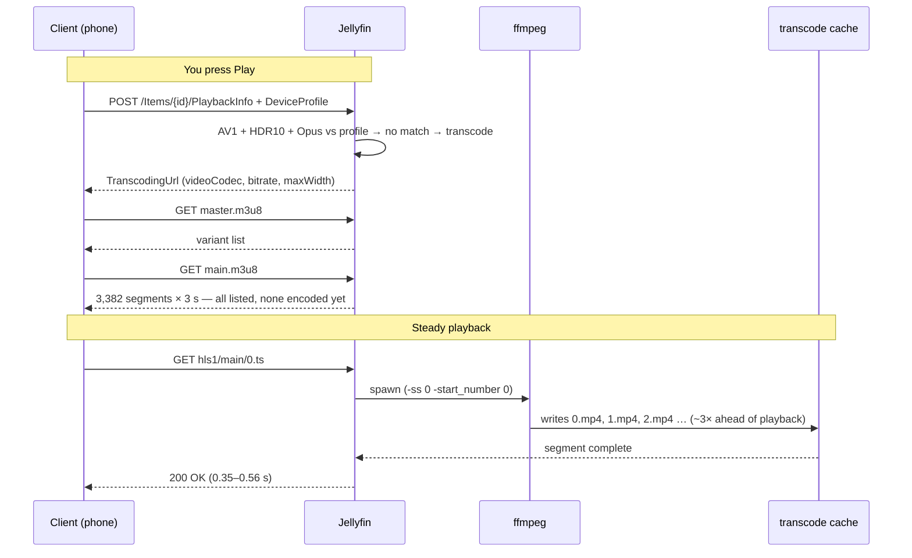
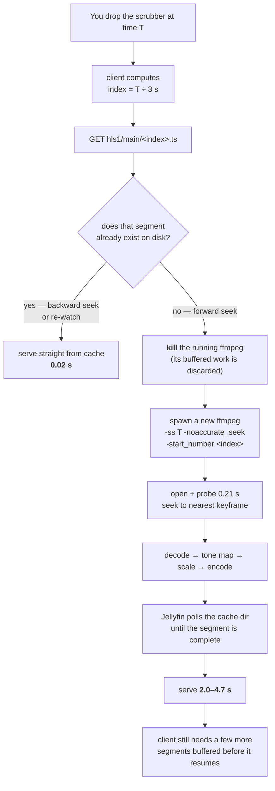

# Seeking — why scrubbing a 4K film is slow on mobile

What happens between the phone and the server when you drag the scrubber, why a
forward seek on a 4K HDR film costs seconds while a backward seek is instant, and
which stage of the pipeline actually burns the time.

For the direct-play/transcode decision itself see [TRANSCODING](TRANSCODING.md);
for the ffmpeg command anatomy see [FFMPEG](FFMPEG.md).

> All numbers here were measured on **2026-08-10** against
> `Interstellar.2014.2160p.AV1.HDR10.OPUS.5.1-UH.mkv` (17 GB, 4K AV1, HDR10,
> 169 min, 3,382 segments) on the NAS's **Intel i5-13500H iGPU** via QSV/VAAPI.

## The short version

| Action | Cost |
|---|---|
| Seek **backward** into already-watched territory | **0.02 s** |
| Continue playing forward | 0.35–0.56 s per segment |
| Seek **forward** into un-transcoded territory | **2.0–4.7 s** |

A 100× difference between the same request served twice. The reason is that
**seeking a transcode does not seek — it kills ffmpeg and starts a new one.**

## Starting a play session



The client sends a **device profile** — the codecs, containers and max bitrate it
accepts. The server picks the output spec from *that*, which is why different
devices get different streams off the same file (see
[Client profile decides the cost](#client-profile-decides-the-cost)).

> **The playlist is a promise, not evidence.** `main.m3u8` lists all 3,382 segments
> the moment playback starts, because it is generated from the file's duration
> (`-hls_playlist_type vod -hls_list_size 0`). This is why the scrubber shows a full
> timeline instantly even though nothing past the first few seconds exists yet.

## What happens when you drag the scrubber



There is no resume-from-a-new-position. The encoder has no such concept: a seek is
always a process restart. Verified — the ffmpeg process count stays at **1**
across seeks, never 2.

`-noaccurate_seek` makes ffmpeg jump to the nearest keyframe *before* the target
instead of decoding forward to the exact frame. That is why playback resumes on a
segment boundary rather than the precise millisecond you aimed at.

### Measured: request order decides everything

| Request | Time | What the server did |
|---|---|---|
| segment 100 — cold | **2.05 s** | killed ffmpeg, respawned at `-start_number 100` |
| segment 100 — again | **0.02 s** | served the file off disk |
| segment 101 | 0.45 s | ffmpeg already running ahead |
| segment 102 | 0.56 s | ffmpeg already running ahead |
| segment 1500 — far forward | **2.18 s** | killed ffmpeg, respawned at `-start_number 1500` |
| segment 1501 | 0.35 s | running ahead again |
| segment 100 — backward | **0.02 s** | still cached |

## Where the time actually goes

Inside ffmpeg, for 300 frames (12.5 s of video):

```
  17 GB file          DECODE           TONE MAP          SCALE         ENCODE
  4K AV1 HDR10   ──►  AV1 → raw   ──►  HDR10 → SDR  ──►  4K→1080p ──►  H.264 5 Mbps
   on /mnt/hdd        1.86 s            +2.00 s           +0.03 s       +0.19 s
                        46 %              49 %              1 %           5 %
                                      ^^^^^^^^^^
                                     the bottleneck
```

| Stage | Cumulative | Cost of this stage | Throughput |
|---|---|---|---|
| decode 4K AV1 (VAAPI) | 1.86 s | 1.86 s | 161 fps — 6.7× realtime |
| **+ HDR→SDR tone map** | 3.86 s | **+2.00 s** | 77 fps |
| + scale to 1080p | 3.89 s | +0.03 s | 77 fps |
| + H.264 encode | 4.08 s | +0.19 s | 73 fps — 3.0× realtime |
| HEVC instead of H.264 (1080p) | 4.96 s | +1.07 s | 60 fps |
| HEVC at 1440p | 5.80 s | +1.91 s vs H.264/1080p | 51 fps — 2.1× realtime |

**Tone mapping is the single largest cost** — more than decode, scale and encode
combined. It is also *constant*: it runs at full 4K **before** the downscale, so
lowering the output resolution does not reduce it.

### What is NOT the bottleneck

Measured and cleared:

| Suspect | Reality |
|---|---|
| Disk | 260 MB/s reading at an 8 GB offset on `/mnt/hdd` |
| The 1 GB probe | 0.21 s vs 0.08 s with defaults — costs 0.13 s |
| 4K AV1 decode | 161 fps, 6.7× realtime. The iGPU eats it |
| Scaling | 0.03 s. Free |
| H.264 encoding | 0.19 s. Effectively free |

> Do not tune `probesize`, move the file to SSD, or worry about AV1 decode. The
> measurements say the money is in tone mapping and — on HEVC clients — the encoder.

### The gap between ffmpeg and HTTP

ffmpeg produces one 3-second segment in ~1.3 s, but the HTTP request takes 2–4.7 s.
The remainder is Jellyfin's own orchestration: killing the old process, spawning
the new one, and polling the cache directory until the segment is written and
complete. None of it is configurable.

## Client profile decides the cost

The same file, two devices, same evening:

| Client | Requests | Pipeline cost |
|---|---|---|
| Jellyfin Android (13.3" tablet) | 1080p **H.264** @ 5 Mbps | 4.08 s / 300 frames |
| Jellyfin iOS (phone) | 1440p **HEVC** @ 7 Mbps | 5.80 s / 300 frames |

The phone asks for **30 % more work** than the tablet for output it cannot resolve
on a 6" screen. HEVC costs ~10× more to encode than H.264 at the same resolution
(+1.07 s vs +0.19 s), and 1440p adds another +0.84 s on top.

**Fix:** cap the iOS app at 1080p / H.264 in Settings → Playback → Maximum Bitrate.

## What actually fixes seeking

In order of effect:

1. **Give mobile an SDR H.264 + AAC source.** Removes tone mapping (the 49 % stage)
   *and* qualifies for Direct Play — no ffmpeg, so seeking becomes a client-side
   byte-range request and is instant. A downloaded 1080p BluRay encode beats a
   transcode of the 4K: no generation loss, and a real SDR grade instead of an
   algorithmic tone map.
2. **Cap the iOS client to 1080p H.264** — ~30 % off every seek on 4K content that
   has not been replaced yet.
3. **Download for offline** in the mobile app — transcodes once, then playback is
   local and seeking is instant.

> **Do not enable `EnableSegmentDeletion`.** That cache is exactly what makes
> backward seeks 0.02 s. Deleting segments mid-playback turns every rewind into a
> full 2 s restart. Current settings — `EnableSegmentDeletion=false`,
> `SegmentKeepSeconds=720` — trade disk for seek speed, which is the right trade.
> The cache measured 14 MB across 8 files during a test session.

## Reproducing the measurements

Stage isolation, run on the NAS (300 frames from a mid-film offset):

```bash
CF='/data/media/movies/Interstellar (2014)/Interstellar.2014.2160p.AV1.HDR10.OPUS.5.1-UH.mkv'
TM='setparams=color_primaries=bt2020:color_trc=smpte2084:colorspace=bt2020nc,procamp_vaapi=b=16,tonemap_vaapi=format=nv12:p=bt709:t=bt709:m=bt709:extra_hw_frames=32'

# decode only — add one stage at a time and compare wall time
docker exec jellyfin /usr/lib/jellyfin-ffmpeg/ffmpeg -hide_banner \
  -init_hw_device vaapi=va:/dev/dri/renderD128,driver=iHD \
  -init_hw_device qsv=qs@va -filter_hw_device qs \
  -analyzeduration 200M -probesize 1G -ss 00:30:13.812 -noaccurate_seek \
  -hwaccel vaapi -hwaccel_output_format vaapi -i "file:$CF" \
  -an -sn -frames:v 300 -f null -

# …then append  -vf "$TM"  for tone map,
#              -vf "$TM,scale_vaapi=w=1920:h=1080"  for scale,
#              -vf "$TM,scale_vaapi=w=1920:h=1080,hwmap=derive_device=qsv,format=qsv" \
#                  -c:v h264_qsv -b:v 5000000  for the full tablet pipeline.
```

Seek behaviour, from any machine with the API key — request a segment, then the
same one again, then one far ahead, and compare:

```bash
curl -s -o /dev/null -w "%{time_total}\n" \
  "http://192.168.31.7:8096/Videos/<itemId>/hls1/main/<n>.ts?<params>"
```

Read the live decision from the newest log in `appdata/jellyfin/log/`:

```bash
ls -t appdata/jellyfin/log/FFmpeg.Transcode-* | head -1 | xargs grep -m1 -oE "ffmpeg .*" \
  | tr ' ' '\n' | grep -E "^-(ss|start_number|hls_time)$" -A1
```

## Appendix — raw benchmark output

Primary evidence for everything above. Captured 2026-08-10 on the NAS
(`ubuntu-2404`, i5-13500H, Intel iGPU via `/dev/dri/renderD128`, iHD driver),
against the 17 GB 4K AV1 HDR10 file, Jellyfin ffmpeg 7.1.4.

### Method and caveats

- Timings are **single runs**, wall-clock, not averaged. Treat them as ratios, not
  precision figures — the stage-to-stage differences are large enough to survive it.
- `docker exec` adds a measured **0.05 s** baseline to every ffmpeg row.
- The source file may have been partially in the host page cache; the 260 MB/s disk
  figure is therefore a **floor on best case**, not a cold-cache number. It does not
  change the conclusion, since disk never appears in the critical path.
- 300 frames = 12.5 s of video at 23.976 fps. 72 frames = one 3 s HLS segment.

### 1 — Component costs and startup

```
===== [A] source file on HDD =====
  size: 17G
  sequential read at ~8 GB offset:
  419430400 bytes (419 MB, 400 MiB) copied, 1.61223 s, 260 MB/s

===== [B] probe cost (Jellyfin uses -analyzeduration 200M -probesize 1G) =====
  ffprobe WITH Jellyfin's big probe                0.21s
  ffprobe with default probe                       0.08s

===== [C] pipeline stages, seeking to 00:30:13.812 =====
  decode only, 1 frame  (= startup+probe+seek)     0.29s
  decode only, 72 frames (= 1 HLS segment)         0.69s
  decode only, 300 frames (steady state)           1.89s

===== [D] FULL pipeline, iOS profile (1440p HEVC 7Mb) =====
  1 frame  (startup)                               0.39s
  72 frames (1 segment)                            1.69s

===== [E] FULL pipeline, tablet profile (1080p H264 5Mb) =====
  1 frame  (startup)                               0.34s
  72 frames (1 segment)                            1.28s

===== [F] docker exec overhead baseline =====
  docker exec true                                 0.05s
```

Startup (open + probe + keyframe seek) is only **0.29–0.39 s**. One segment costs
**1.28 s** (tablet) to **1.69 s** (iOS) — yet the HTTP request takes 2–4.7 s. The
difference is Jellyfin's process teardown/respawn and its wait-for-complete polling.

### 2 — Stage isolation (300 frames, each row adds one stage)

```
  1. decode only (AV1 4K -> VAAPI)               1.86s   161 fps   6.71x realtime
  2. + tone map (HDR->SDR)                       3.86s    77 fps   3.21x realtime
  3. + scale to 1080p                            3.89s    77 fps   3.21x realtime
  4. + H.264 encode  (tablet profile)            4.08s    73 fps   3.04x realtime
  5. + HEVC encode   (same 1080p)                4.96s    60 fps   2.50x realtime
  6. HEVC at 1440p   (iOS today)                 5.80s    51 fps   2.12x realtime
```

Row 2 minus row 1 is the tone-map tax: **+2.00 s**, larger than every other stage
combined. Row 5 minus row 4 isolates HEVC vs H.264 at identical resolution:
**+0.88 s**, roughly 10× the H.264 encode cost. Row 6 minus row 5 is the 1440p
penalty: **+0.84 s**.

> A control run without tone mapping (`decode + scale + H.264` on the HDR source)
> **failed** — `h264_qsv` rejected the input with "Terminating thread with return
> code -22 (Invalid argument)". The HDR10 surface needs the format conversion that
> `tonemap_vaapi` performs, so the SDR path cannot be measured on an HDR source.
> The ~2.1 s it would cost is inferred from rows 1, 3 and 4, not measured.

### 3 — Seek behaviour over HTTP

```
playlist has 3382 segments, 3s each

  seg 100   COLD - first request (seek)          2.05s  HTTP 200
    ffmpeg procs now: 1
  seg 100   SAME segment again (on disk)         0.02s  HTTP 200
  seg 101   NEXT segment (already produced)      0.45s  HTTP 200
  seg 102   NEXT+1 (streaming ahead)             0.56s  HTTP 200
  seg 1500  FAR FORWARD seek (restart!)          2.18s  HTTP 200
    ffmpeg procs now: 1
  seg 1501  next after the far seek              0.35s  HTTP 200
  seg 100   BACK to old position (still cached?) 0.02s  HTTP 200

=== transcode cache on disk ===
  8 files, 14M in /config/cache/transcodes/
```

The process count staying at **1** across both cold seeks is the proof that Jellyfin
kills and respawns rather than running a second encoder.

### 4 — The seek command Jellyfin actually issues

```
-analyzeduration 200M -probesize 1G
-ss 00:30:13.812  -noaccurate_seek
-hwaccel vaapi -hwaccel_output_format vaapi
-i file:"/data/media/movies/Interstellar (2014)/Interstellar.2014.2160p.AV1.HDR10.OPUS.5.1-UH.mkv"
-f hls -hls_time 3 -hls_segment_type fmp4
-hls_playlist_type vod -hls_list_size 0
-start_number 604
-hls_segment_filename "/config/cache/transcodes/3f95cdc8489f0a7f9b9a8a3f691d969f%d.mp4"
```

`604 × 3 s = 1812 s = 30:12`, matching `-ss 00:30:13.812` — the segment index *is*
the timestamp divided by the segment duration.

## See also

- [TRANSCODING](TRANSCODING.md) — direct play vs direct stream vs transcode
- [FFMPEG](FFMPEG.md) — reading a Jellyfin ffmpeg command, logs, exit codes
- [MONITORING](MONITORING.md) — watching the box while a transcode runs

> **Note:** TRANSCODING.md and FFMPEG.md were written for the NVIDIA/NVENC era, when
> Jellyfin ran on the RTX 4080 box. Jellyfin now runs on the NAS's Intel iGPU
> (QSV/VAAPI), so their `nvenc`/`cuvid` specifics no longer describe this system.
