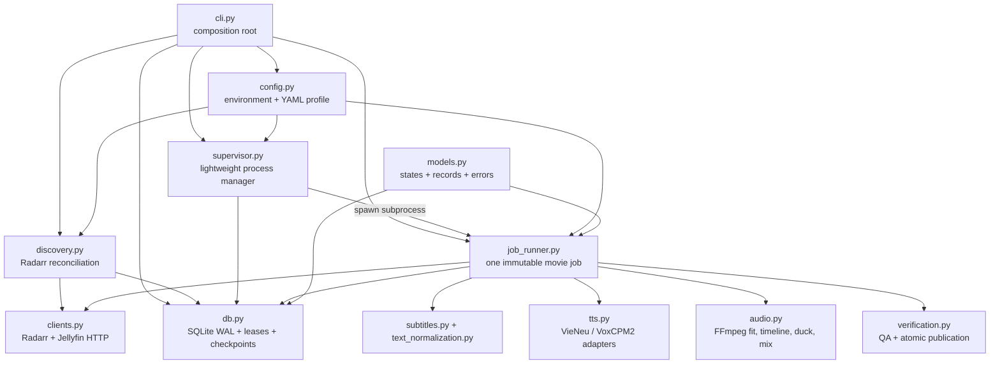
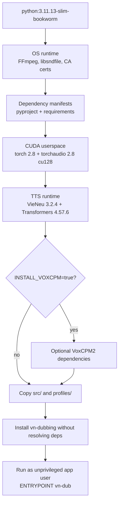
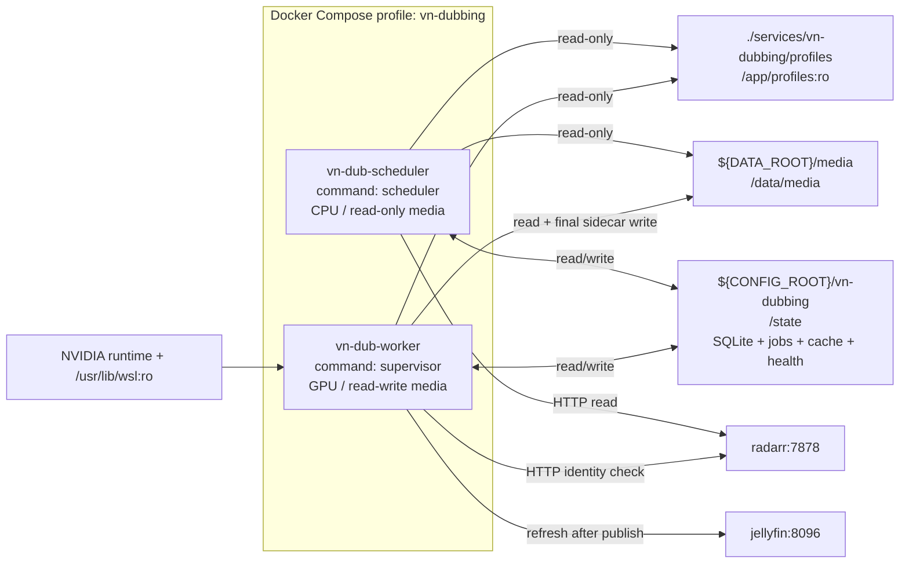

# Vietnamese AI dubbing — coding and container patterns

This document describes how the implemented service is split into Python
components, how its Docker image is assembled, and how Docker Compose connects
the scheduler and worker. It complements the product decisions in
[proposals.md](proposals.md), the delivery gates in
[implementation-plan.md](implementation-plan.md), and the commands in
[operator-guide.md](operator-guide.md).

## Component architecture

The service is one installable Python package with a single `vn-dub` command.
The command selects a role; it does not create separate code paths for manual
and automated work.



### Responsibility rules

| Component | Owns | Must not own |
|---|---|---|
| `cli.py` | Argument parsing and dependency assembly | TTS, FFmpeg filters, or SQL |
| `config.py` | Environment parsing and profile validation | Runtime orchestration |
| `discovery.py` | Idempotent Radarr-to-job reconciliation | Model loading or media writes |
| `db.py` | Schema, short transactions, leases, checkpoints | HTTP, FFmpeg, or model code |
| `supervisor.py` | Leasing and child-process lifecycle | Importing Torch or a TTS SDK |
| `job_runner.py` | End-to-end state machine for one movie | Discovering unrelated movies |
| `tts.py` | Common speech adapters and pinned model loading | Timing, mixing, or publication |
| `audio.py` | Deterministic audio transforms | Queue state or API calls |
| `verification.py` | Output checks and atomic file replacement | Synthesis |

These boundaries keep the hourly control plane small and testable. In
particular, `supervisor.py` must never import Torch, VieNeu, or VoxCPM2. It
launches a new Python child for a leased movie; model RAM and VRAM are released
when that child exits.

## Runtime component flow

```mermaid
sequenceDiagram
    participant R as Radarr
    participant S as scheduler
    participant Q as SQLite WAL
    participant P as supervisor
    participant C as per-movie child
    participant F as FFmpeg
    participant M as Media directory
    participant J as Jellyfin

    loop every hour
        S->>R: GET exact vn-dub tag and movies
        S->>M: Find preferred Vietnamese SRT
        S->>Q: INSERT OR IGNORE immutable job identity
    end
    P->>Q: BEGIN IMMEDIATE; lease one job
    P->>C: Spawn vn-dub run --job ...
    loop each subtitle cue
        C->>C: Normalize text and synthesize
        C->>F: Trim, loudness-normalize, tempo-fit
        C->>Q: Checkpoint paths, hashes, QA, attempts
    end
    C->>F: Build speech timeline and gain envelope
    C->>F: Duck original bed and mix Vietnamese voice
    C->>C: Verify codec, duration, channels, and size
    C->>M: Atomic rename to final .vi.aac sidecar
    C->>J: Refresh library item
    C-->>P: Exit and release model/GPU memory
```

The job identity hashes the Radarr movie/file IDs, resolved media path,
subtitle checksum, profile checksum, and engine. Repeated scans are therefore
safe, while a changed subtitle, profile, movie file, or model engine creates new
work.

The hourly scanner is intentionally the only automated producer of jobs. There
is no webhook listener, enqueue HTTP endpoint, or Bazarr post-processing hook.
Reducing discovery latency by at most one hour has very low ROI for a 5–10-hour
worker, while a second trigger path adds authentication, correlation,
deduplication, and recovery work.

## Coding patterns

### Thin composition root

`cli.py` creates `Settings`, `Profile`, and `Database`, then delegates to a
component function. New commands should follow this pattern:

```python
settings, profile, database = _runtime()
return component_operation(settings, profile, database)
```

Business rules should remain callable without parsing command-line arguments.
That allows tests to inject a fake Radarr client, temporary SQLite database, or
fake TTS backend.

### Environment versus versioned profile

Environment variables describe deployment facts and secrets: container paths,
API URLs and keys, polling periods, resource gates, and the selected engine.
The YAML profile describes reproducibility-sensitive media behavior: exact model
and codec revisions, voice ID, sampling, tempo, loudness, ducking, and output
encoding.

```text
.env (not committed)                  profiles/voice-over-v1.yaml (committed)
├── API keys                          ├── model + revision
├── /state and /data/media paths      ├── voice + sampling
├── scan/lease intervals              ├── timing/loudness policy
└── disk/VRAM admission limits        └── mix + output codec
```

Changing the YAML bytes changes its SHA-256 and therefore the job identity.
Never move a synthesis parameter into an ad-hoc environment variable merely to
avoid versioning the profile.

### Adapter boundary for speech engines

Both engines implement the same small interface:

```python
class TtsBackend:
    def synthesize(self, text: str, output_path: Path, seed: int) -> None: ...
    def close(self) -> None: ...
```

`VieneuV2Backend` is the production default. `VoxCpm2Backend` is a disabled
cold backup that additionally validates the reference WAV checksum and exact
transcript. A movie job creates exactly one adapter; a final track never mixes
voices from different engines.

VieNeu can occasionally generate an abnormally long stochastic take. The job
runner therefore applies this bounded pattern per cue:

```text
synthesize candidate -> trim/normalize/fit -> fits within 1.35x?
        yes -> accept and checkpoint
        no  -> regenerate, at most four total candidates
after limit -> keep shortest candidate and record too_long warning
```

If more than 1% of spoken cues remain `too_long`, the movie moves to
`needs_review` instead of being silently published.

### SQLite as a durable queue

SQLite is appropriate because there is one scheduler, one worker, and one
active movie. The implementation uses WAL mode, a five-second busy timeout,
short connections, and `BEGIN IMMEDIATE` only while selecting and updating a
lease. No HTTP request, synthesis, hashing, or FFmpeg process runs inside a
database transaction.

```text
jobs         one immutable movie/profile/engine identity and its lease
cues         normalized input, artifact paths/checksums, QA and attempts
events       append-only operational state history
discoveries  latest reason a tagged movie is queued or waiting
```

Every completed cue stores the fitted WAV checksum. Resume reuses the file only
when its state and checksum are valid; otherwise that cue is regenerated.

### Atomic artifact pattern

Any file that another component may consume follows:

```text
write <name>.partial -> close producing process -> validate -> os.replace
```

The source movie is always read-only from application code. The only media-tree
write is the final AAC sidecar, published after verification. Intermediate WAV,
manifests, database files, and the model cache stay under `/state`.

### Errors and retry ownership

Typed pipeline errors distinguish configuration/permanent failures from
resource deferrals and retryable failures. Resource admission does not consume
a job attempt. Cue-level stochastic duration retries happen inside the child;
job-level retry happens through the SQLite state machine. This prevents a
single bad cue from restarting five hours of completed work.

## Docker build components

One image is built and reused by both Compose services. Its layer order keeps
dependency layers reusable when only Python source changes.



Build the normal VieNeu image:

```bash
docker compose --profile vn-dubbing build vn-dub-worker
```

Build an image that also contains the disabled VoxCPM2 runtime:

```bash
VN_DUB_INSTALL_VOXCPM=true \
  docker compose --profile vn-dubbing build vn-dub-worker
```

The image contains code and runtime libraries, but not downloaded model
weights. Hugging Face snapshots are pinned by revision and cached in
`${CONFIG_ROOT}/vn-dubbing/model-cache`, so rebuilding the image does not throw
away the model cache. CUDA user-space libraries come from the image; the kernel
driver is supplied by the host through the NVIDIA container runtime.

`INSTALL_VOXCPM` controls image contents only. Selecting VoxCPM2 also requires
`VN_DUB_ENGINE=voxcpm2`, `fallback_model.enabled: true`, and an approved pinned
reference audio/transcript/checksum. These separate gates prevent an accidental
fallback.

## Docker Compose wiring



Both services use `nas-lab/vn-dubbing:0.1.0`, the same environment anchor, the
same profile, and the same `/state`. Their differences are intentional:

| Concern | Scheduler | Worker |
|---|---|---|
| Command | `scheduler --interval ...` | `supervisor` |
| GPU | None | NVIDIA reservation and WSL driver libraries |
| Media mount | Read-only | Read-write for final sidecar only |
| State mount | Read-write | Read-write |
| Model loaded | Never | Only in per-movie child |
| Health age | Slightly longer than scan interval | Three minutes |

There are no exposed ports and no separate web server. The services reach
Radarr and Jellyfin by Compose DNS on the default project network. Operators use
`docker compose exec` or `run --rm` for status, retries, and smoke tests.

The `vn-dubbing` Compose profile is a deployment safety switch. Neither service
starts during an ordinary `docker compose up -d`; the profile must be named
explicitly. This switch is independent from the Radarr `vn-dub` movie tag: the
Compose profile enables the system, while the Radarr tag opts in an individual
movie.

## State and ownership map

```text
host                                         container
${CONFIG_ROOT}/vn-dubbing/             <->   /state
├── dubbing.sqlite3                           durable queue
├── dubbing.sqlite3-wal                       active WAL
├── model-cache/                              pinned model snapshots
├── jobs/<job-id>/                            manifests and cue artifacts
└── health/                                   scheduler/supervisor heartbeats

${DATA_ROOT}/media/                     <->   /data/media
├── movies/.../Film.mkv                       never modified
├── movies/.../Film.vi.srt                    read as input
└── movies/.../Film.Vietnamese AI Voice-over.vi.aac
                                                verified atomic publication
```

Compose runs both containers as `${PUID}:${PGID}`. That identity must be able to
write `/state`; it must also be able to create a sidecar in movie directories.
The scheduler's read-only media bind gives it no ability to publish even when
filesystem ownership would otherwise allow it.

## Change patterns

When adding a new TTS engine, implement `TtsBackend`, add explicit profile
validation, pin all model/runtime revisions, add an image build gate for large
optional dependencies, and make the engine part of job identity. Do not add a
second queue or bypass the child-process boundary.

When changing the database, increment `SCHEMA_VERSION`, write an explicit
migration before deploying new code, and back up SQLite with its online backup
API or while both services are stopped. Copying only `dubbing.sqlite3` while WAL
writers are active is not a valid backup.

When changing FFmpeg behavior, keep commands as argument arrays, write to a
temporary output, add a synthetic integration assertion, and preserve the
contract that source media is never opened for writing.

## Validation before deployment

Run from the repository root:

```bash
PYTHONPATH=services/vn-dubbing/src \
  python -m unittest discover -s services/vn-dubbing/tests -v

docker compose --profile vn-dubbing config --quiet
docker compose --profile vn-dubbing build vn-dub-worker
```

Then follow the smoke, disk-space, API-key, sidecar-client, and pilot gates in
[operator-guide.md](operator-guide.md). A successful image build is not
authorization to start the automation.
