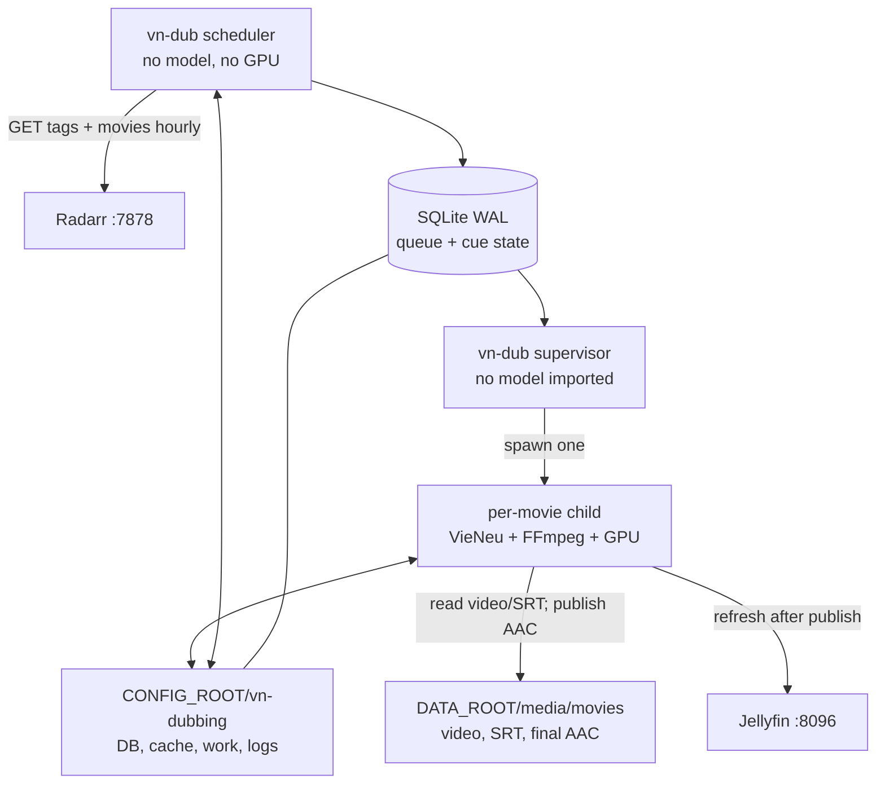
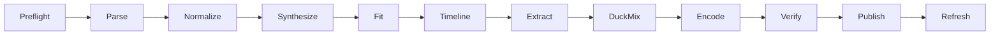

# Vietnamese AI dubbing — implementation plan

Implementation plan for the architecture selected in
[proposals.md](proposals.md). This document describes what to build, in what
order, and how each phase is proven before the next begins.

**Status:** MVP implementation is staged but not enabled. The service code,
Compose profile, SQLite queue, VieNeu v2 worker, FFmpeg mixer and tests exist;
the scheduler and supervisor remain stopped until the activation gates pass.

**Selected MVP:** hourly Radarr discovery, durable SQLite queue, one
run-to-completion VieNeu child process per movie, Phase 1 AI voice-over mixing,
and a Jellyfin external AAC audio sidecar.

## Model and voice selection

Use **`pnnbao-ump/VieNeu-TTS-v2` with the Northern male `Tuyên` preset** as the
primary Phase 0 candidate. Pin this model revision:

```text
b62b1cbddec67cb1d26ac602965d39f0a7faddf2
```

VieNeu v2 is the best default for this particular workload: it is Vietnamese
native, has explicit Northern male presets (`Tuyên` and `Bình`), is only 0.3B
parameters, supports Vietnamese/English code-switching, and can run directly in
the worker without a resident model server. A preset voice is also more
reproducible than reconstructing a voice from a text description for every cue.

Initial synthesis settings:

```yaml
model: pnnbao-ump/VieNeu-TTS-v2
revision: b62b1cbddec67cb1d26ac602965d39f0a7faddf2
voice_name: Tuyên
voice_id: Tuyen
emotion: natural
tone_policy: neutral_steady
temperature: 1.0
top_k: 50
backend: cuda
```

Phase 0 rejected `temperature: 0.3`/`top_k: 20`: the test sentence ran for
32.9 seconds. A later `0.8`/`50` rerun also produced a 27.46-second outlier, so
one good smoke clip is not evidence of stability. Production keeps the upstream
`1.0`/`50` sampler and regenerates a cue up to four times when duration QA says
it cannot fit safely. It selects the shortest take and retains a warning if all
attempts exceed the 1.35x tempo limit. Neutrality comes from the fixed voice,
normalization and post-processing, not from starving the autoregressive sampler.

Blind-test `Tuyên` against the other built-in Northern male preset, `Bình`, on
the same real movie excerpts. Use `Tuyên` as the starting default, not as a final
approval made from the voice name alone.

Add **`openbmb/VoxCPM2`** as the Phase 0 quality challenger and cold backup,
pinned to:

```text
bffb3df5a29440629464e5e839f4d214c8714c3d
```

VoxCPM2 is larger (2B parameters), multilingual, expressive, and produces 48 kHz
audio. It can be the better choice if a legally usable, clean Northern male
reference recording is available. In that case use Ultimate Cloning with the
same reference audio and exact transcript for every speech unit, plus fixed
`seed`, `cfg_value` and `inference_timesteps`. Do not use Voice Design for the
production voice: a prompt such as "Northern Vietnamese man" describes a voice
but does not provide a durable speaker identity.

Phase 0 must test at least 100 real subtitle cues, including one-to-five-word
lines, numbers, names, punctuation, English code-switching, emotional scenes and
ten consecutive scene windows. Compare pronunciation, speaker drift, repeated
generation, artifacts, timing fit, peak VRAM and elapsed time. Promote VoxCPM2
only if its audible improvement justifies the larger model and reference-voice
workflow; otherwise keep VieNeu v2.

The backup is not a hot resident service and its model must not consume VRAM
while VieNeu or Jellyfin is running. Implement both models behind the same
speech-unit interface, but load exactly one backend in the per-movie child.
VoxCPM2 becomes production-ready only after its reference recording, transcript
and inference profile pass Phase 0 and are pinned.

Fallback rules:

- never combine VieNeu and VoxCPM2 clips in one published movie track;
- retry a transient VieNeu failure from checkpoints using VieNeu;
- if VieNeu is unusable, start a new whole-movie job with the VoxCPM2 profile;
- require an explicit operator choice for quality fallback; pronunciation or
  style differences must not silently change the voice;
- use a new job/profile identity, and regenerate every speech unit; and
- retain the original movie and any already published verified track until the
  replacement has passed verification.

Sources: [VieNeu v2 model card and preset voices](https://huggingface.co/pnnbao-ump/VieNeu-TTS-v2)
and [VoxCPM2 model, cloning and inference settings](https://github.com/OpenBMB/VoxCPM).

## Speech-consistency contract

Consistency is a pipeline property, not only a model choice. Every production
job must obey these rules:

1. Pin the model revision, SDK/lockfile, container digest and versioned synthesis
   profile. Never run `latest`.
2. Resolve the selected preset once when the movie child starts, retain the same
   `voice_data` for every speech unit, and record its ID and reference checksum
   in the job manifest.
3. Keep `emotion: natural` and all exposed sampling parameters fixed. If the
   selected backend supports a seed, derive a reproducible seed from the job and
   speech-unit IDs and record it.
4. Apply one versioned text-normalization policy to the complete subtitle before
   synthesis. Names, abbreviations, numbers and punctuation must not be handled
   differently between retries.
5. Join fragmented subtitle cues only when they form one sentence, the gap is
   small, and the resulting speech unit can still be aligned safely. This avoids
   restarting prosody for every one-word subtitle without turning a full scene
   into an unalignable clip.
6. Apply identical silence trimming, fades, tempo limits, loudness target, EQ and
   limiting to every generated unit. Do not normalize clips by peak alone.
7. Save the normalized text, synthesis parameters, raw/fitted audio hashes and
   QA result for every unit. A resume must reuse valid artifacts rather than
   silently regenerating them with a potentially different voice.
8. During Phase 0, create a speaker-embedding baseline from accepted samples and
   calibrate a similarity warning threshold. Flag or regenerate outliers; do not
   invent a universal threshold without measuring the selected voice.

### Neutral-tone policy

The MVP uses a consistent neutral narrator, not actor-by-actor emotional acting:

- keep VieNeu `emotion: natural` for the entire library; never select
  `storytelling` or add per-cue emotion/style tags;
- normalize excessive exclamation marks, ellipses and repeated punctuation while
  preserving punctuation needed for correct phrasing;
- use one base speaking-rate policy and prefer shortening an overfull translation
  over aggressive tempo changes;
- apply the same loudness target, gentle compression, EQ and fades to every
  speech unit;
- measure speaking rate, loudness and pitch-range statistics against accepted
  Phase 0 samples, and flag statistical outliers for review; and
- do not apply pitch flattening as a general post-process because it creates a
  robotic voice and can damage Vietnamese tones.

`Tuyên` and `Bình` must be blind-tested for neutrality. Select whichever is more
stable across neutral, angry, sad and excited source scenes; do not ask the model
to copy those source emotions. If VoxCPM2 is enabled, its canonical reference
must itself be recorded in a neutral, steady delivery and the same fixed control
instruction must be used for every speech unit.

## Before activation

The temporary `vieneu-tts` Gradio portal was removed on 2026-08-09. Its
container, mutable 14.2 GB image, 1.9 GB model cache and Compose service are no
longer part of the stack. Port 8298 is free.

Activation is blocked until the following Phase 0 gates pass:

1. reclaim at least 20 GB on `/mnt/f` (only 4.4 GB was free on 2026-08-09);
2. listen to and approve the pinned VieNeu model/`Tuyen` preset smoke sample;
3. verify an external `.vi.aac` track on every Jellyfin client that matters;
4. approve the Phase 1 result as **AI voice-over**, not true dialogue-replaced
   dubbing; and
5. measure a short GPU synthesis run alongside the existing Jellyfin/Ollama GPU
   tenants.

Do not start with the scheduler or database. First prove that one short video can
be turned into an acceptable selectable audio track.

## Scope

### MVP includes

- movies managed by Radarr;
- opt-in through the exact Radarr tag `vn-dub`;
- SRT Vietnamese subtitle sidecars;
- a single pinned VieNeu preset voice per movie;
- cue-by-cue resumable synthesis;
- bounded tempo adjustment to fit subtitle windows;
- Vietnamese speech mixed over a ducked original soundtrack;
- AAC-LC, stereo, 48 kHz external audio output;
- hourly reconciliation;
- one active job at a time;
- retry, resume, structured logs and verification; and
- Jellyfin refresh after atomic publication.

### Explicitly excluded

- Sonarr episodes;
- source separation and true dialogue replacement;
- automatic speaker identification and multiple voices;
- a web UI;
- Bazarr and Radarr webhook/event fast paths (rejected for low ROI);
- embedded MKV remuxing;
- multiple simultaneous GPU workers; and
- automatic deletion of stale or orphaned outputs.

## Service architecture



The scheduler and supervisor are long-running but lightweight. The supervisor
must not import `torch`, VieNeu or codec modules. It starts a separate child for
one movie; the child exits at completion or failure, allowing the OS/CUDA runtime
to release all model RAM and VRAM.

The existing Gradio portal is not restored. A CLI smoke-test command replaces it
for voice evaluation.

## Repository layout

```text
nas-lab/
├── docker-compose.yml
├── .env.example
├── services/
│   └── vn-dubbing/
│       ├── Dockerfile
│       ├── pyproject.toml
│       ├── requirements-tts.txt
│       ├── requirements-voxcpm.txt
│       ├── profiles/
│       │   └── voice-over-v1.yaml
│       ├── src/
│       │   └── vn_dubbing/
│       │       ├── __init__.py
│       │       ├── cli.py
│       │       ├── config.py
│       │       ├── db.py
│       │       ├── models.py
│       │       ├── clients.py
│       │       ├── discovery.py
│       │       ├── supervisor.py
│       │       ├── job_runner.py
│       │       ├── subtitles.py
│       │       ├── text_normalization.py
│       │       ├── tts.py
│       │       ├── audio.py
│       │       └── verification.py
│       └── tests/
│           ├── test_audio.py
│           ├── test_db.py
│           ├── test_discovery.py
│           ├── test_ffmpeg_integration.py
│           ├── test_job_runner.py
│           └── test_subtitles.py
└── docs/arr-servers/vietnamese-ai-dubbing.md/
    ├── proposals.md
    ├── implementation-plan.md
    ├── coding-and-container-patterns.md
    └── operator-guide.md
```

The code boundaries, Docker image layers and exact Compose wiring are documented
separately in
[coding-and-container-patterns.md](coding-and-container-patterns.md).

Keep this pipeline isolated from `scripts/ai-translate-sub.py`. Translation may
produce the Vietnamese SRT consumed by dubbing, but translation and dubbing have
different lifecycles, retry policies and GPU loads.

## Process and CLI contracts

One CLI provides operator commands and container entrypoints:

```text
vn-dub discover --once
vn-dub scheduler --interval 3600
vn-dub supervisor
vn-dub run --movie-id <radarr-id>
vn-dub smoke-test --text <text> --output <wav>
vn-dub status [--job <id>]
vn-dub retry --job <id>
vn-dub cancel --job <id>
vn-dub mark-stale --movie-id <radarr-id>
vn-dub verify --job <id>
```

Contract details:

- `discover --once` never runs TTS; it only reconciles Radarr into SQLite.
- `scheduler` calls the same idempotent discovery operation once per interval.
- `supervisor` leases one pending job and spawns `run` as a child process.
- `run` handles exactly one immutable job identity and exits.
- `smoke-test` is the only manual voice-testing path; it loads and unloads the
  same pinned model configuration as production.
- all no-op discovery conditions return exit code 0;
- configuration errors return 2; retryable job failures return 10; permanent
  verification/publication failures return 20.

## Configuration contract

The implementation adds these placeholders to `.env.example`:

```dotenv
# Vietnamese AI voice-over
VN_DUB_TAG=vn-dub
VN_DUB_ENGINE=vieneu-v2
VN_DUB_INSTALL_VOXCPM=false
VN_DUB_SCAN_INTERVAL=3600
VN_DUB_SUPERVISOR_POLL_INTERVAL=30
VN_DUB_LEASE_SECONDS=180
VN_DUB_MIN_MEDIA_FREE_GB=20
VN_DUB_STOP_PUBLISH_FREE_GB=10
VN_DUB_MIN_WORK_FREE_GB=10
VN_DUB_MIN_FREE_VRAM_MB=7000
VN_DUB_REQUIRE_GPU=true
VN_DUB_JELLYFIN_REFRESH=true
VN_DUB_MAX_ATTEMPTS=3
RADARR_URL=http://radarr:7878
RADARR_API_KEY=
JELLYFIN_URL=http://jellyfin:8096
JELLYFIN_API_KEY=
```

Exact synthesis and mix parameters belong in a versioned YAML profile rather
than scattered environment variables:

```yaml
profile_version: 1
model:
  engine: vieneu-v2
  repository: pnnbao-ump/VieNeu-TTS-v2
  revision: b62b1cbddec67cb1d26ac602965d39f0a7faddf2
  voice_name: Tuyên
  voice_id: Tuyen
  emotion: natural
  temperature: 1.0
  top_k: 50
  backend: cuda
fallback_model:
  enabled: false  # enable only after the Phase 0 reference-voice gate
  repository: openbmb/VoxCPM2
  revision: bffb3df5a29440629464e5e839f4d214c8714c3d
  mode: ultimate_clone
  reference_audio: <pinned-consented-Northern-male-reference>
  reference_transcript: <exact pinned transcript>
  reference_sha256: <sha256>
  seed: 42
  cfg_value: 2.0
  inference_timesteps: 10
speech:
  tone_policy: neutral_steady
  allow_emotion_tags: false
  max_tempo: 1.35
  max_synthesis_attempts: 4
  voice_lufs: -18
mix:
  mode: voice_over
  duck_db: -14
  activity_padding_before_ms: 120
  activity_padding_after_ms: 250
  merge_activity_gap_ms: 300
  attack_ms: 80
  release_ms: 300
  true_peak_limit: 0.891251
output:
  codec: aac
  sample_rate: 48000
  bitrate: 160k
  channels: 2
```

Changing the profile version changes job identity. Never use an unpinned model
or mutable `latest` image in production.

Secrets stay in `.env` or a later Docker-secret mechanism; they must not enter
Git, logs, manifests or command lines printed by the worker.

## Compose design

Build one pinned project image and run it with two commands:

```yaml
services:
  vn-dub-scheduler:
    build:
      context: ./services/vn-dubbing
    profiles: ["vn-dubbing"]
    command: ["scheduler", "--interval", "3600"]
    restart: unless-stopped
    # CPU-only; shared SQLite state and read-only media discovery.

  vn-dub-worker:
    build:
      context: ./services/vn-dubbing
    profiles: ["vn-dubbing"]
    command: ["supervisor"]
    restart: unless-stopped
    # GPU reservation; shared state; media read/write only for final publish.
```

Required mounts:

| Container path | Host source | Scheduler | Worker |
|---|---|---:|---:|
| `/state` | `${CONFIG_ROOT}/vn-dubbing` | read/write | read/write |
| `/data/media` | `${DATA_ROOT}/media` | read-only | read/write |
| `/usr/lib/wsl` | `/usr/lib/wsl` | none | read-only |

The worker image must include `ffmpeg`, `ffprobe`, the pinned VieNeu dependency,
the matching CUDA/PyTorch runtime and no public server/tunnel entrypoint. It does
not publish a port and does not mount the Docker socket.

Use the stack's existing log-rotation anchor. Add a health check that tests the
supervisor heartbeat and SQLite access; it must not load the model.

## State and database design

Use SQLite in WAL mode at `/state/dubbing.sqlite3`. Apply schema migrations at
startup under an exclusive migration lock.

### `jobs`

| Column | Purpose |
|---|---|
| `id` | UUID or integer primary key |
| `identity_hash` | unique deterministic job identity |
| `radarr_movie_id` | stable Radarr movie identifier |
| `radarr_movie_file_id` | changes on import/upgrade |
| `video_path` | exact current `/data/media/...` path |
| `subtitle_path` | exact selected Vietnamese SRT |
| `subtitle_sha256` | immutable input fingerprint |
| `profile_sha256` | model/voice/mix configuration fingerprint |
| `state` | state-machine value |
| `attempts` | bounded retry counter |
| `lease_owner`, `lease_expires_at` | single-worker lease |
| `cue_count`, `completed_cues` | progress |
| `last_error_code`, `last_error` | diagnosable failure |
| `created_at`, `updated_at`, `completed_at` | lifecycle timestamps |

Create a unique index on `identity_hash` and indexes on `(state, created_at)` and
`radarr_movie_id`.

### `cues`

| Column | Purpose |
|---|---|
| `job_id`, `cue_index` | composite primary key |
| `start_ms`, `end_ms` | immutable target window |
| `source_text`, `normalized_text` | reproducibility |
| `text_sha256` | artifact validation |
| `state`, `attempts` | per-cue recovery |
| `raw_audio_path`, `fitted_audio_path` | ext4 artifacts |
| `raw_duration_ms`, `fitted_duration_ms`, `tempo` | quality evidence |
| `warning_code` | overlap, too-long, normalization issue, etc. |

### `events`

Append state transitions and operator actions for audit/debugging. Store bounded,
structured details, not full API responses or secrets.

## Filesystem contract

```text
appdata/vn-dubbing/
├── dubbing.sqlite3
├── profiles/
│   └── voice-over-v1.yaml
├── model-cache/
├── jobs/
│   └── <job-id>/
│       ├── manifest.json
│       ├── normalized.srt
│       ├── cues/
│       │   ├── 000001.raw.wav
│       │   └── 000001.fitted.wav
│       ├── timeline.wav
│       ├── voice-over.aac
│       └── verification.json
└── logs/
```

All intermediates remain on ext4. Publication writes only the final compressed
AAC to `/mnt/f`:

```text
<video-stem>.Vietnamese AI Voice-over.vi.aac.partial
    -> fsync/close
    -> atomic rename on /mnt/f
<video-stem>.Vietnamese AI Voice-over.vi.aac
```

Never build a movie-length WAV or cue cache on `/mnt/f`.

## Discovery implementation

### Radarr query

1. `GET /api/v3/tag`; resolve the exact case-sensitive `vn-dub` label.
2. `GET /api/v3/movie`; keep movies containing that numeric tag ID.
3. Resolve the imported movie file and its current path/file ID.
4. Normalize the Radarr `/data/...` path; reject paths outside `/data/media`.
5. Find a Vietnamese SRT with deterministic precedence.
6. Fingerprint inputs/profile and insert-or-ignore the job identity.
7. Reconcile existing jobs against movie upgrades, removed tags and missing
   files without deleting anything automatically.

### Subtitle precedence

Initial precedence, highest first:

1. provider/manual normal Vietnamese: `<stem>.vi.srt` or `<stem>.vie.srt`;
2. translated track: `<stem>.AI.vi.srt`;
3. other titled Vietnamese tracks after explicit allow-listing.

Exclude `forced`, `foreign`, `sdh`, `cc` and `hi` tracks from automatic dubbing.
If two candidates have equal precedence, mark the movie `ambiguous_subtitle` and
require operator selection rather than guessing.

### Reconciliation rules

- Repeated scan with unchanged inputs: no-op.
- `vn-dub` removed before start: cancel pending job.
- `vn-dub` removed while running: finish the current cue, checkpoint and cancel.
- Movie file ID changes: mark old job `superseded`; discover a new identity.
- Subtitle hash changes after completion: mark output `stale`, do not spend
  another 5–10 hours automatically in the MVP.
- Missing subtitle: persist `waiting_subtitle`, not a failure.

## Per-movie worker stages



### 1. Preflight

- Re-fetch the Radarr movie and confirm tag, file ID and path.
- Re-hash the subtitle and profile.
- Check `/mnt/f` and ext4 free-space thresholds.
- Check free VRAM and active-job lock.
- Run `ffprobe` on the movie and select the original audio stream according to a
  documented rule.
- Estimate temporary and final output sizes.

Fail before model loading if any precondition changed.

### 2. Parse and normalize

- Parse SRT structurally with UTF-8/BOM handling.
- Reject empty, invalid or non-monotonic input with a useful report.
- Strip HTML/ASS markup from spoken text.
- Drop configurable non-speech annotations such as music notes and sound-effect
  brackets.
- Normalize numbers, dates, units, abbreviations and punctuation for Vietnamese
  speech.
- Preserve source and normalized text in the cue table/manifest.

### 3. Synthesize and checkpoint

- Load VieNeu once in the child.
- Start with sequential speech-unit generation. Enable batching only after the
  pinned SDK proves stable ordering, memory bounds and identical voice quality.
- Treat each returned cue as an independent artifact; a batch is only a
  throughput optimization, never the checkpoint boundary.
- Validate sample count/non-silence, then rename to its deterministic cue path.
- Commit cue state only after the artifact is durable.
- On resume, verify artifact hash/metadata and skip completed cues.
- Emit heartbeat and progress at least once per minute.

### 4. Timing policy

- Keep the cue's start time fixed.
- If speech fits, preserve natural speed and pad with silence.
- If it overruns, use quality-preserving tempo adjustment up to the configured
  maximum (initially 1.35x).
- Never truncate silently.
- Record `too_long` when the cue still cannot fit.
- Put overlapping cues on separate mix lanes; do not overwrite one speaker with
  another.

The Phase 0 proof decides whether `too_long` cues fail the job or publish with a
warning threshold. Recommended initial gate: fail human review if more than 1%
of spoken cues cannot fit.

### 5. Voice-over mix

- Decode the selected original audio stream on ext4.
- Create a movie-length Vietnamese speech timeline.
- Normalize the Vietnamese foreground to the profile voice loudness target.
- Generate a deterministic gain envelope from actual Vietnamese speech
  activity, including configured pre/post padding and attack/release ramps.
- Lower the complete original mix to the configured duck floor only while that
  envelope is active; leave it unchanged outside Vietnamese speech.
- Merge activity gaps shorter than the configured threshold so the original bed
  does not audibly pump between words.
- Mix the Vietnamese foreground over that bed and apply a final true-peak
  limiter without clipping.
- Encode AAC-LC stereo at 48 kHz/160 kbit/s.

The initial `-14 dB` duck floor is a listening-test starting point. It lowers
original dialogue enough to understand the Vietnamese voice while retaining
music, effects and ambience. Test `-12`, `-14` and `-16 dB`; choose one profile
for the complete library rather than tuning every cue independently.

This MVP lowers the **whole original soundtrack**, not only the original actor's
voice. Selective dialogue reduction requires a second quality tier:

1. separate the source into a dialogue stem and a music/effects stem, or use a
   supplied M&E stem;
2. mute or heavily lower the dialogue stem during translated speech;
3. keep the M&E stem near its original level; and
4. mix Vietnamese speech over M&E.

For 5.1 sources, a center-channel reduction is a cheap experiment because
dialogue is often center-heavy, but it is not reliable enough to call true
dialogue removal: music and effects may also occupy the center, and dialogue can
spill into other channels. Source separation is deferred until the voice-over
MVP is accepted.

Do not call this output `AI Dub`; it is `AI Voice-over` until original dialogue
has actually been removed.

### 6. Verify and publish

Automated verification must prove:

- output contains exactly one playable AAC audio stream;
- start time is zero and duration is within 250 ms of video duration;
- sample rate/channels/bitrate match profile;
- every required cue is completed or represented by an approved warning;
- sampled cue windows contain speech energy;
- peak level does not clip;
- output filename matches the exact current video stem; and
- target free space remains above the stop-publish threshold.

Only then copy to `.partial`, close/flush and rename on `/mnt/f`. Trigger a
Jellyfin refresh and record whether it succeeded; a refresh failure is retryable
without regenerating audio.

## GPU admission and priority

Jellyfin playback is higher priority than dubbing. Ollama translation should
complete and unload before VieNeu begins.

MVP admission:

1. scheduler may enqueue at any time;
2. supervisor starts no job below `VN_DUB_MIN_FREE_VRAM_MB`;
3. optionally query Jellyfin sessions and wait while video transcoding is active;
4. never start more than one child; and
5. checkpoint each cue so an operator can cancel safely.

Do not attempt automatic CUDA preemption in the MVP. If active playback must
interrupt dubbing, implement cooperative cancellation between cues and restart
from checkpoints.

## Implementation phases

### Phase 0 — technical proof, no automation

Deliverables:

- `smoke-test` loads a pinned model, generates one Vietnamese WAV and exits;
- a 2–5 minute test video and Vietnamese SRT fixture;
- manual cue generation, timing, duck/mix and external AAC publication;
- Jellyfin playback verified on web, TV and mobile clients in use;
- benchmark report: generation ratio, total time, system RAM, VRAM, work bytes,
  final bytes and timing warnings; and
- selected model, voice and mix profile recorded immutably.

Exit gate: a human approves intelligibility, timing and voice-over experience.

### Phase 1 — deterministic single-movie CLI

Deliverables:

- project skeleton, locked dependencies and Dockerfile;
- subtitle parser/normalizer;
- cue synthesis/checkpointing;
- timing and FFmpeg mix;
- verification and atomic external-audio publication;
- `run --movie-id` and `verify`; and
- unit/integration tests for the offline pipeline.

Exit gate: rerunning the same immutable job is a no-op and killing/restarting it
resumes without regenerating completed cues.

### Phase 2 — durable queue and hourly discovery

Deliverables:

- SQLite migrations and state machine;
- Radarr client/tag discovery;
- idempotent identity and reconciliation;
- scheduler and supervisor commands;
- leases, heartbeats, retry budgets and operator CLI; and
- fake-Radarr integration tests.

Exit gate: three repeated scans create one job, one worker acquires it, and a
stale lease is recovered safely.

### Phase 3 — Compose and NAS integration

Deliverables:

- scheduler and worker Compose services;
- state/media/WSL GPU mounts with least required access;
- `.env.example` additions without secrets;
- log rotation and health checks;
- Jellyfin refresh client;
- Beszel visibility and operational runbook; and
- end-to-end test with one Radarr-tagged short film.

Exit gate: adding `vn-dub` produces a selectable non-default Vietnamese audio
track without modifying the movie bytes.

### Phase 4 — reliability rollout

Deliverables:

- failure-injection tests at synthesis, assembly, publication and refresh;
- disk and VRAM admission tests;
- stale/superseded/orphan reporting;
- artifact retention/cleanup command;
- backup guidance for SQLite/manifests; and
- one full feature-film pilot followed by two more controlled pilots.

Exit gate: all acceptance criteria in `proposals.md` pass and resource usage is
acceptable during real Jellyfin activity.

## Test strategy

### Unit

- SRT parsing, malformed cues, BOM and multiline speakers;
- Vietnamese filename classification and precedence;
- non-speech annotation removal and number normalization;
- identity hashing and profile versioning;
- job state transitions and lease expiry;
- video-stem-to-sidecar naming;
- tempo decisions, overlaps and warning thresholds; and
- free-space/VRAM admission decisions.

### Integration without GPU

- temporary SQLite database in WAL mode;
- fake Radarr/Jellyfin HTTP servers;
- synthetic FFmpeg video/audio fixtures;
- scheduler idempotency and reconciliation;
- worker crash/restart with pre-created cue artifacts;
- `.partial` publication failure; and
- Jellyfin refresh retry without TTS rerun.

### GPU smoke

- three short Vietnamese cues including numbers and English technical terms;
- cold and warm model load;
- VRAM returned after child exit;
- deterministic artifact metadata for pinned inputs; and
- simultaneous Ollama/Jellyfin admission refusal.

### End to end

1. tag a short Radarr movie `vn-dub`;
2. ensure a normal Vietnamese SRT exists;
3. run discovery twice and confirm one job;
4. kill the child after several cues;
5. restart and confirm resume;
6. verify/publish the sidecar;
7. refresh Jellyfin;
8. confirm original audio remains default;
9. select Vietnamese and play beginning/middle/end; and
10. remove the tag and confirm no destructive cleanup occurs.

## Operational commands

```bash
# Discover without changing media
docker compose --profile vn-dubbing run --rm vn-dub-scheduler discover --once

# Inspect queue and one job
docker compose --profile vn-dubbing exec vn-dub-scheduler status
docker compose --profile vn-dubbing exec vn-dub-scheduler status --job <id>

# Retry only after inspecting the recorded error
docker compose --profile vn-dubbing exec vn-dub-scheduler retry --job <id>

# Cooperative stop after the current cue
docker compose --profile vn-dubbing exec vn-dub-scheduler cancel --job <id>

# Model/voice proof without a persistent server
docker compose --profile vn-dubbing run --rm vn-dub-worker \
  smoke-test --text "Xin chào Việt Nam" --output /state/smoke.wav
```

These commands are implemented. See [operator-guide.md](operator-guide.md)
before starting the long-running services.

## Documentation deliverables

Implementation must add:

- `README.md` under `services/vn-dubbing` for development and tests;
- an operator guide under `docs/arr-servers/user-guide` or this directory;
- configuration reference with safe defaults;
- failure/recovery runbook;
- model/voice benchmark report from Phase 0; and
- an incident report for any failure that modifies or hides media.

Update `technical/ARCHITECTURE.md` and the main quickstart only when the services
are genuinely deployed, not while they are design-only.

## Definition of done

The MVP is done when:

1. an operator opts in exactly one movie with `vn-dub`;
2. hourly discovery inserts one durable job and never duplicates it;
3. one child loads VieNeu once and checkpoints all cues;
4. interruption resumes from verified cue artifacts;
5. Phase 1 voice-over preserves the original soundtrack at a ducked level;
6. verification prevents partial/invalid output publication;
7. Jellyfin shows `Vietnamese (AI Voice-over)` as a selectable, non-default track;
8. the source movie and original audio remain byte-for-byte unchanged;
9. model RAM/VRAM is released when the child exits;
10. disk/VRAM pressure blocks new work safely;
11. logs and status explain waiting, progress, retry and failure without secrets;
12. a movie upgrade is reconciled as new input; and
13. three pilot movies complete with approved timing and playback quality.
