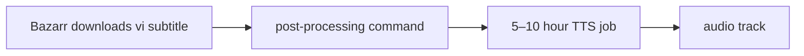
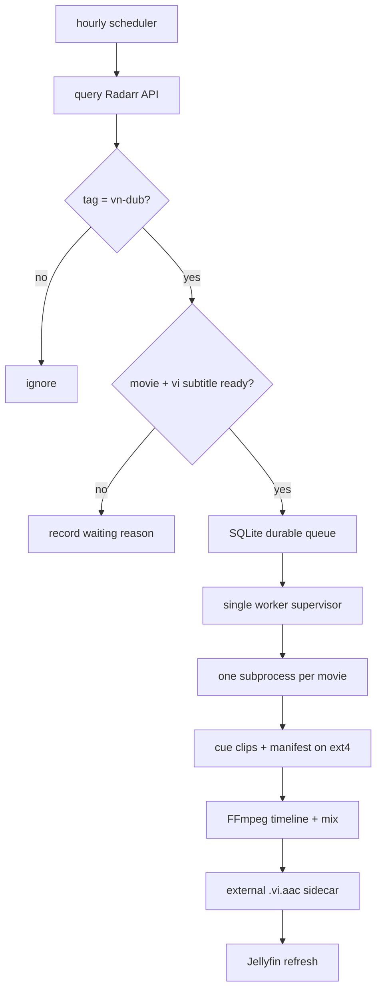
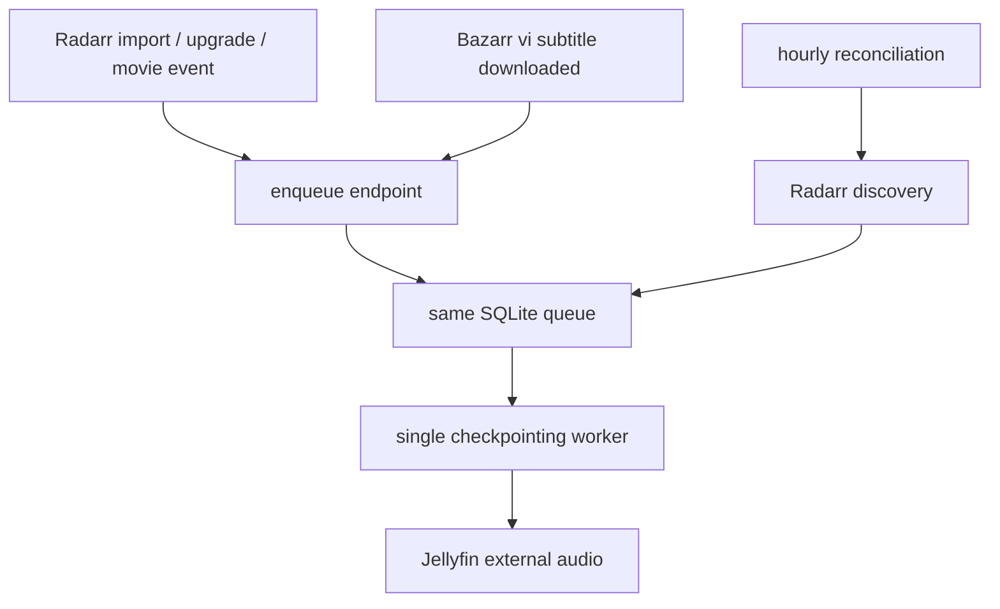
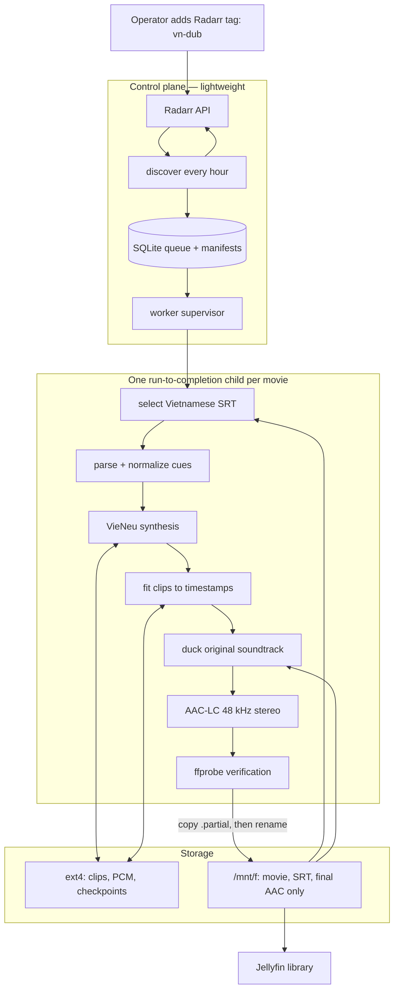
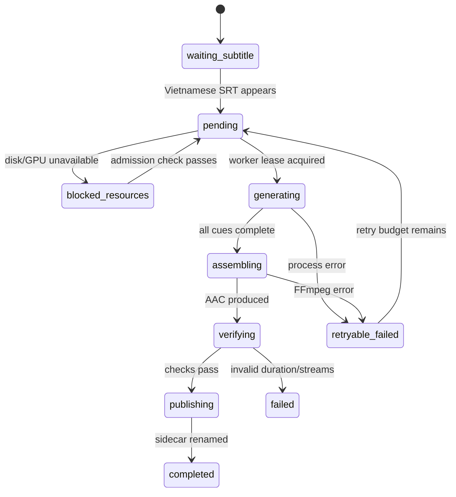

# Vietnamese AI dubbing pipeline

Design for turning a movie's Vietnamese subtitle into a selectable Vietnamese
audio track in Jellyfin. The operator opts a movie in by applying the Radarr tag
`vn-dub`.

**Status:** design selected and MVP code staged. The opt-in Compose services are
not running while the media disk and Phase 0 approval gates remain unresolved.

**Decision:** use an hourly Radarr scanner, a durable SQLite queue, one
checkpointing worker, and a Jellyfin external AAC audio sidecar. The hourly scan
is the only automated trigger. Radarr/Bazarr webhooks are rejected because their
small latency improvement has very low value beside a 5–10-hour generation job.

The concrete build sequence, service boundaries, schema, CLI contracts and test
gates are in [implementation-plan.md](implementation-plan.md).
The implemented Python patterns, Docker build layers and Compose wiring are in
[coding-and-container-patterns.md](coding-and-container-patterns.md).

## What “dubbing” means here

Subtitle-to-speech alone creates a dialogue/narration track. It does not contain
the movie's music or sound effects, and mixing it over the untouched soundtrack
leaves the original dialogue audible. The first version should therefore be
described honestly as **Vietnamese AI voice-over**:

1. generate Vietnamese speech from each subtitle cue;
2. place the speech at the cue timestamps;
3. duck the original soundtrack while Vietnamese speech is active; and
4. mix both into a complete selectable audio track.

True dialogue replacement is a later quality tier. It requires either a usable
music/effects stem, source separation, or careful treatment of multichannel
center audio. Source separation is imperfect and materially increases processing
time.

```text
Phase 1: subtitles -> speech -> ducked original + speech = AI voice-over
Phase 2: subtitles -> speech -> music/effects stem + speech = AI dub
```

The Jellyfin track title must reflect the implemented tier:

- `Vietnamese (AI Voice-over)` for Phase 1;
- `Vietnamese (AI Dub)` only when the original dialogue has been removed.

## Constraints on this host

| Resource | Current state | Design consequence |
|---|---|---|
| GPU | RTX 4080 Super, 16 GB | Run one dubbing job at a time and admit work only when sufficient VRAM is free. |
| GPU tenants | Jellyfin NVENC, Ollama, VieNeu | Check contention before starting a movie; checkpoint between every cue. |
| Media disk | `/mnt/f`, 932 GB, **4.4 GB free (100% used)** on 2026-08-09 | Do not enable automation until space is reclaimed. Never keep intermediate PCM or clips here. |
| Work disk | WSL ext4 root, **848 GB free** on 2026-08-09 | Store queue state, generated clips, manifests and temporary mixes under `CONFIG_ROOT`. |
| Runtime | One movie may take 5–10 hours | Triggers must enqueue and return immediately. The worker must resume after restart. |

A two-hour AAC-LC track at 160 kbit/s is about 144 MB. That is much smaller than
a second movie or a remux temporary file, but `/mnt/f` is still too full for a
reliable unattended writer. Require at least 20 GB free before starting a job and
stop publishing when free space falls below 10 GB.

## Proposal review

### A. Bazarr post-processing runs the job — rejected



Bazarr officially supports a custom command after downloading a subtitle, but
the long job must not execute in that hook. It couples Bazarr to GPU availability,
retries and process lifetime; it also misses subtitles that already existed or
were created outside Bazarr.

Source: [Bazarr post-processing settings](https://wiki.bazarr.media/Additional-Configuration/Settings/#use-custom-post-processing).

### B. Hourly scanner plus persistent worker — recommended MVP



The hourly task performs discovery only and normally finishes in seconds. It can
run again while a job is active because queue insertion is idempotent. The
worker processes one job at a time.

This proposal covers existing subtitles, new subtitles, upgrades and restarts
with the fewest moving pieces. Its only material cost is up to one hour of
discovery latency, irrelevant beside a 5–10-hour generation.

Radarr exposes tags and movie records through its v3 API; API keys remain in
environment/config secrets and must never be written into this document. Source:
[Radarr API documentation](https://radarr.video/docs/api/).

### C. Radarr/Bazarr events plus hourly reconciliation — rejected



Events can reduce discovery latency from at most one hour, but they do not reduce
the 5–10-hour synthesis time. They require another endpoint or hook, event
authentication, failure handling, correlation between movie and subtitle
events, and deduplication while hourly reconciliation is still required for
correctness. That operational cost is not justified for this NAS. Do not
implement an enqueue HTTP endpoint, Radarr Connect handler, or Bazarr
post-processing hook.

Source: [Radarr Connect triggers](https://wiki.servarr.com/radarr/settings#connect).

### D. Event correlation without reconciliation — rejected

Keeping separate “movie imported” and “subtitle ready” event state is valid, but
using it as the only discovery mechanism creates invisible missed-work failures.
The hourly API scan is cheap and provides the repair path, so there is no reason
to omit it.

## Output delivery review

### External AAC audio sidecar — recommended

Jellyfin officially supports external audio tracks for movies. If the video is:

```text
Movie Name (2026).mkv
```

publish the Phase 1 result beside it as:

```text
Movie Name (2026).Vietnamese AI Voice-over.vi.aac
```

The arbitrary filename text becomes the track title and `vi` identifies the
language. Do not include `default`: the original audio remains the default and
the user selects Vietnamese in Jellyfin's audio menu.

```text
Movie folder
├── Movie Name (2026).mkv
├── Movie Name (2026).vi.srt
└── Movie Name (2026).Vietnamese AI Voice-over.vi.aac
```

Benefits:

- the Radarr-managed movie remains byte-for-byte unchanged;
- hardlinks and torrent seeding are not disturbed;
- no full-size temporary movie copy is required;
- an upgraded movie can be handled as a new file identity; and
- deleting or regenerating the AI track is cheap and recoverable.

Jellyfin documents the naming and parsing rules in
[External Subtitles and Audio Tracks](https://jellyfin.org/docs/general/server/media/movies/#external-subtitles-and-audio-tracks).
Validate playback on the actual Jellyfin clients used by the household before
enabling bulk generation.

### Remux an extra audio stream into the MKV — fallback

Embedding the track produces conventional multi-audio media and is the fallback
if an important Jellyfin client mishandles external audio. It is not the default
on this host because it modifies a Radarr-managed, often hardlinked file and
requires a second full-size movie during safe replacement.

If it becomes necessary:

1. write a new MKV to an ext4 work path;
2. map every input video, audio, subtitle, chapter and attachment stream;
3. copy all existing streams without re-encoding;
4. add the AAC track with language `vie`, a clear title, and `default=0`;
5. validate streams and duration with `ffprobe`;
6. copy to a `.partial` file on the target filesystem;
7. `fsync` and rename on the target filesystem; and
8. refresh Radarr and Jellyfin.

Never rewrite the original in place. A failed remux must leave it untouched.

### Separate dubbed video version — rejected for normal use

This nearly doubles storage and makes users select a movie version rather than
an audio track. Jellyfin supports versions, but it is a poor fit for this disk
and this requirement.

## Recommended architecture



### Why the worker owns VieNeu directly

The temporary `vieneu-tts` Gradio container was retired on 2026-08-09. It was
not a production automation interface. For a single long batch, the worker
should load VieNeu directly in a child process:

- no dependency on Gradio's internal API contract;
- one model load per movie instead of one per subtitle cue;
- the child exit reliably releases RAM and VRAM; and
- checkpointed clips survive a model or container restart.

Use an explicit CLI smoke-test command for comparing voices and pronunciation
instead of keeping a model server resident. Pin the chosen model, voice and
synthesis settings in worker configuration before generating the first
production track.

## Discovery contract

The scheduler queries Radarr once per hour and resolves the numeric tag ID for
`vn-dub`. A movie is eligible only when all conditions pass:

```text
Radarr movie contains vn-dub tag
movie has an imported, supported video file
normal Vietnamese subtitle exists beside that exact video
subtitle is not forced-only
no completed output exists for the current input identity
no pending or running job has the same identity
media disk and work disk pass free-space thresholds
```

Do not infer eligibility from directory names. Radarr is the authority for user
intent and the current movie file.

### Job identity and idempotency

Use a deterministic identity such as:

```text
radarr_movie_id
+ radarr_movie_file_id
+ SHA-256(subtitle bytes)
+ TTS model revision
+ voice/config revision
+ mix profile revision
```

A unique database constraint on that identity makes repeated cron runs and
duplicate events harmless. Store the identity in a JSON manifest beside the
work files and in the final output metadata where practical.

Recommended initial policy:

- movie-file upgrade: enqueue a new job;
- manual voice/config change: enqueue a new job;
- subtitle change after completion: mark `stale`, require explicit regeneration
  during the MVP to avoid silently spending another 5–10 hours;
- removal of `vn-dub`: do not start pending work, but do not automatically delete
  an existing audio track.

## Queue and recovery

SQLite is sufficient because there is one scheduler and one worker. Keep it on
ext4 under `${CONFIG_ROOT}/vn-dubbing`, not `/mnt/f`.



Each job records:

- state, attempt count and last error;
- worker lease/heartbeat and timestamps;
- movie, video, subtitle and output paths;
- input fingerprints and synthesis configuration;
- total cue count and last completed cue; and
- generated duration and verification results.

On startup, reclaim a `generating` job only when its heartbeat is stale and no
matching worker process exists. Never run two workers for the same job.

## Audio-generation contract

### Subtitle handling

1. Parse SRT structurally; never send sequence numbers or timestamps to the TTS
   model.
2. Normalize Unicode and Vietnamese punctuation.
3. Remove formatting and hearing-impaired annotations that should not be spoken,
   such as music notes or `[door closes]`, under explicit rules.
4. Preserve a cleaned-text manifest so pronunciation bugs can be reproduced.
5. Use one pinned preset voice for the whole movie in the MVP.

### Timing

For every cue:

1. synthesize into a per-cue file on ext4;
2. measure actual duration;
3. fit it to the cue window with bounded tempo adjustment;
4. avoid extreme speed changes that destroy intelligibility;
5. handle overlapping cues explicitly, either with independent mix lanes or a
   deterministic serialization rule; and
6. checkpoint the result before advancing.

Do not truncate speech silently. Mark cues that cannot fit within the allowed
tempo range and surface them in the final quality report.

### Mix and encoding

For Phase 1, create a complete movie-length mix:

```text
original audio ── dynamic ducking during speech ──┐
                                                   ├─ mix ─ AAC-LC
Vietnamese cue timeline ──────────────────────────┘
```

Initial output target:

```text
codec       AAC-LC
sample rate 48 kHz
channels    stereo
bitrate     160 kbit/s
start time  0
duration    within 250 ms of the movie duration
default     false
language    vi/vie
```

The Phase 1 starting profile lowers the complete original mix by 14 dB only
while Vietnamese speech is active, with short attack/release ramps and activity
padding. A/B test `-12`, `-14` and `-16 dB`; keep the selected level and timing in
a versioned mix profile so a change produces a new job identity. This lowers the
original voice and also the music/effects during those windows. Lowering dialogue
alone requires an M&E stem or source separation and belongs to Phase 2.

## Resource admission

The worker checks resources before acquiring a job, not after loading the model:

```text
/mnt/f free >= 20 GB
ext4 free >= estimated temporary requirement + safety margin
no other dubbing job running
GPU has configured free-VRAM margin
optional: Jellyfin has no active video transcode
```

Because generation is cue-based, a worker can stop safely between cues if the
GPU is needed urgently; completed clips remain valid. The MVP may instead finish
the current movie once admitted, but it must never start two movies concurrently.

Ollama unloads after five idle minutes in the current Compose configuration.
Start dubbing after translation has completed so the LLM releases its roughly
5.6 GB allocation before VieNeu begins. Jellyfin playback remains higher priority
than background dubbing.

## Publication and verification

The output becomes visible only after it is complete:

1. encode and verify on ext4;
2. check duration, codec, sample rate, channels and nonzero speech content;
3. copy to `<final-name>.partial` in the movie directory;
4. flush and close the file;
5. rename `.partial` to the final `.aac` name on `/mnt/f`; and
6. request a Jellyfin library refresh or allow the scheduled scan to discover it.

The final name must be derived from the current video stem, never from the Radarr
movie title alone. This is what associates the external track with the correct
Jellyfin item.

Minimum automated checks:

```text
ffprobe opens output                         PASS
AAC audio stream exists                      PASS
duration approximately equals video          PASS
output size is plausible                     PASS
all required cue indices accounted for       PASS
random cue windows contain non-silent audio  PASS
no .partial file remains after publication   PASS
```

Then perform a human spot check at the beginning, middle and end before treating
the first implementation as production-ready.

## Failure and lifecycle behavior

- A failed job never changes the movie or deletes its subtitle.
- Partial work stays on ext4 for retry and is cleaned only after retention expires.
- The final sidecar is immutable for a completed job; regeneration publishes a
  new file only after verification.
- Movie upgrades create a new identity. The scheduler should report orphaned old
  sidecars rather than deleting them automatically.
- Subtitle upgrades mark the output stale according to the configured policy.
- Removing `vn-dub` prevents new work but is not authorization to delete output.
- Logs must include job ID and Radarr movie ID, never API keys.

## Phased rollout

### Phase 0 — prerequisites

- Reclaim at least 20 GB on `/mnt/f`.
- Select one VieNeu model, preset voice and accent with a CLI smoke test.
- Confirm the target Jellyfin clients expose an external `.vi.aac` track.
- Choose and tag one short test movie with `vn-dub`.

### Phase 1 — manual proof

- Run the pipeline manually for the test movie.
- Produce AI voice-over, not source-separated dubbing.
- Verify timing, pronunciation, ducking, audio selection and client playback.
- Record actual run time, RAM, VRAM and output size.

### Phase 2 — reliable MVP

- Deploy hourly discovery, SQLite queue and one worker supervisor.
- Add per-cue checkpoints, retry limits, disk/VRAM gates and structured logs.
- Publish external AAC sidecars and trigger Jellyfin refresh.

### Phase 3 — quality improvements

- Evaluate source separation or multichannel dialogue reduction.
- Add per-character voices only if speaker attribution is reliable.
- Add a small status UI and manual retry/regenerate controls.

## Acceptance criteria for implementation

The first automated version is complete only when all of these are demonstrated:

1. Only a Radarr movie tagged `vn-dub` is enqueued.
2. Repeated hourly scans create no duplicate job.
3. Killing the worker mid-movie resumes from completed cues.
4. Bazarr remains responsive while a job runs.
5. Original movie bytes and original audio remain unchanged.
6. Jellyfin shows both original and `Vietnamese (AI Voice-over)` audio choices.
7. Original audio remains the default.
8. A failed generation publishes no final sidecar.
9. The worker releases VieNeu RAM/VRAM after the per-movie child exits.
10. A movie-file upgrade is detected as new work without corrupting the old job.
