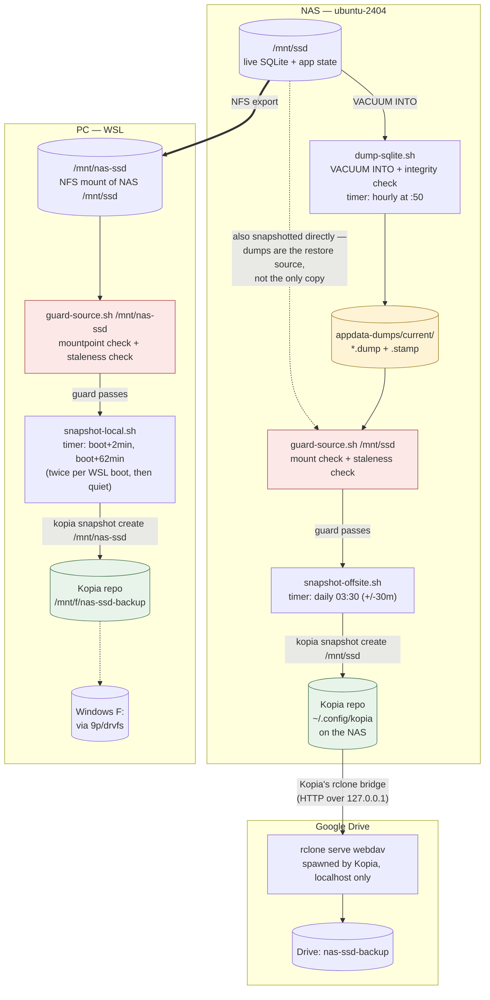
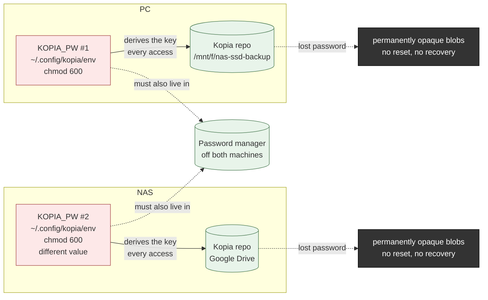
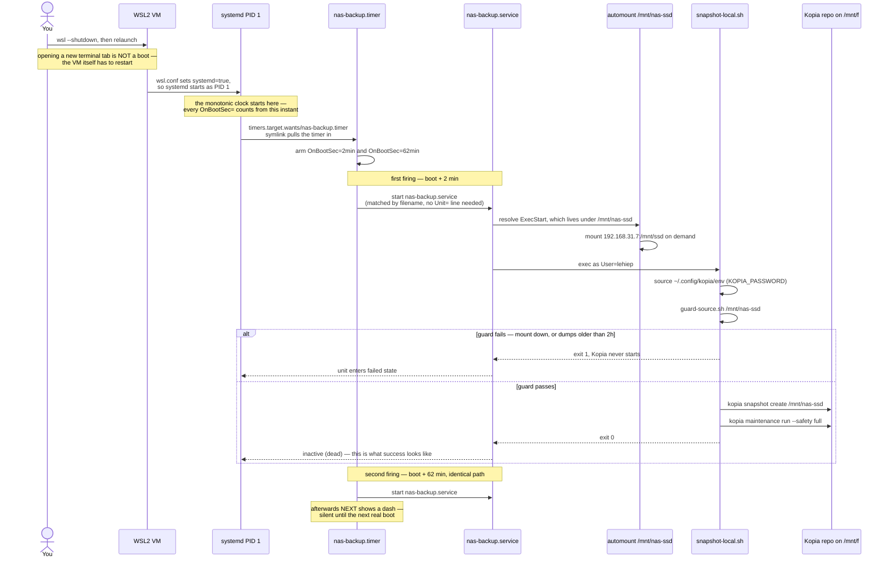
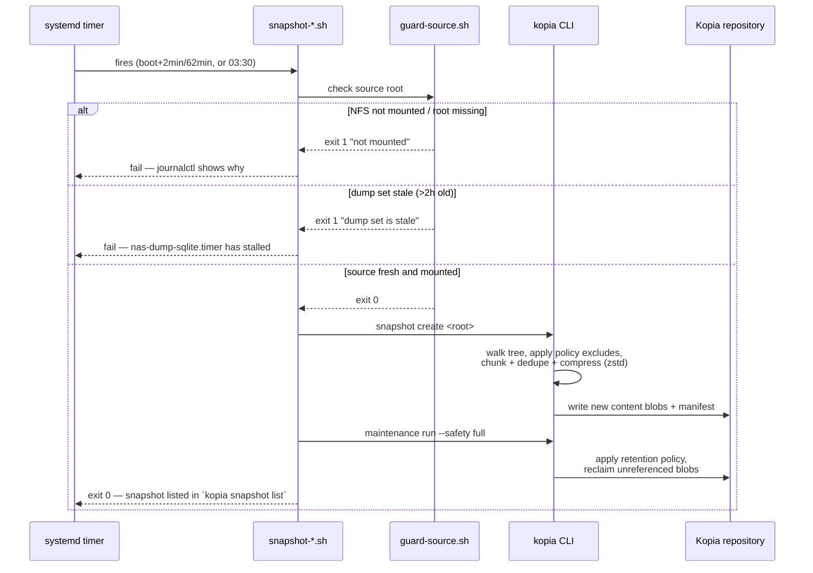

# Backup services — plan

Architecture and pipeline for the two services designed in
[README.md](README.md). Read that first for *why*; this file is *what it looks
like* — diagrams of the components, the data flow, and the timing. For exact
commands, see [QUICK-START.md](QUICK-START.md).

**Kopia** runs both legs: service (1) to `/mnt/f` on the PC, service (2) to
Google Drive on the NAS via Kopia's rclone bridge.

Everything lands in the shared checkout under `scripts/backup/`, so both hosts
read the same files (the repo is NFS-mounted onto the PC at `/mnt/nas-ssd`).
Scripts and unit files are already written and committed:

```
scripts/backup/
├── apply-policy.sh         # set retention + exclusions, then verify they landed
├── backup-status.sh        # health report for BOTH legs; exits non-zero if wrong
├── dump-sqlite.sh          # quiesce SQLite, runs on the NAS
├── excludes.txt            # shared by both services
├── guard-source.sh         # refuses to snapshot on a stale/missing source
├── lib-state.sh            # cross-host heartbeat, sourced by both snapshot scripts
├── snapshot-local.sh       # service (1), runs on the PC
├── snapshot-offsite.sh     # service (2), runs on the NAS
└── systemd/                # unit files for both hosts, ready to install
    ├── nas-dump-sqlite.{service,timer}
    ├── nas-backup.{service,timer}
    └── nas-offsite.{service,timer}
```

Each host has exactly **one** Kopia repository — `/mnt/f` on the PC, Drive on the
NAS — so both use Kopia's default config location (`~/.config/kopia/`). No
`--config-file` juggling needed.

| | Service (1) — local | Service (2) — offsite |
|---|---|---|
| Host | PC (WSL) | NAS |
| Destination | `/mnt/f/nas-ssd-backup` | Google Drive, via rclone |
| Depends on | NAS-side SQLite dumps, hourly | same |
| Needs from you | `sudo` (install), a repo password | `sudo`, a Google Cloud project + OAuth consent, browser access once |

Failure alerts and the restore drill are open/ongoing items, not one-time
setup — see [QUICK-START.md](QUICK-START.md#failure-alerts) and
[RESTORE.md](RESTORE.md#the-drill).

---

## Architecture

Two hosts, two independent Kopia repositories, one shared quiesce step in the
middle. Nothing crosses between the two repositories — they only share the
dumps and the exclusion list that feed them both.



Both guard boxes are the same script (`guard-source.sh`), parameterized by
root — it is what makes an empty NFS mount or a stale dump set a hard stop
instead of a silently empty, retention-eligible snapshot.

## Secrets — why `KOPIA_PW` matters

The two green repository boxes in the diagram above are encrypted, and
`KOPIA_PW` is the only thing that makes them openable. It isn't your Linux
login — it's a separate secret Kopia uses to derive the key that encrypts
everything written to the repo, checked on every `kopia repository connect`
and every snapshot operation, not just at creation.



Three things this diagram is making concrete:

- **Two passwords, not one.** Each host holds its own `KOPIA_PW`, scoped to
  the one repository on that host. A leaked or lost password on the PC has no
  effect on the Drive repo, and vice versa — this is what backs the format/host
  independence argued for in [Two repositories, not
  one](README.md#two-repositories-not-one).
- **Encryption is why both destinations are safe to use at all.** `/mnt/f` is
  a Windows drive that could be removed or stolen; the Drive copy leaves the
  house entirely. Without `KOPIA_PW`, both would just be plaintext `appdata` —
  including `.env` and `docs/CREDENTIALS.md` — sitting somewhere outside this
  machine's control.
- **There is no password reset.** It isn't tied to an account and can't be
  recovered by anyone, including you, if it only exists in your memory and in
  `~/.config/kopia/env`. That file surviving is not enough on its own — if the
  host it's on is what died, the file died with it. That's the whole reason
  [QUICK-START.md](QUICK-START.md) says to put it in a password manager
  immediately after repository creation, on both legs.

## Boot sequence — WSL restart to snapshot

Service (1) is the only leg triggered by a **boot** rather than a wall clock,
and the chain from "WSL starts" to "a snapshot exists" runs through four
separate files on the PC. Worth drawing once, because when it doesn't fire the
only useful question is *which link broke*.



Two properties of this chain are worth stating outright, because both have
already caused confusion:

- **A new terminal window is not a boot.** `OnBootSec=` is measured from when
  the WSL VM started, not from when you opened a shell. A box that has been up
  15 hours has both triggers far in the past and will show `NEXT: -` — correct
  behaviour, not a stalled timer.
- **`ExecStart` lives on the filesystem being backed up.** systemd has to reach
  `/mnt/nas-ssd` just to find the script, which works only because fstab
  declares the mount `x-systemd.automount` and it gets pulled up on access. The
  service carries no explicit `Requires=`/`After=` on `mnt-nas\x2dssd.mount`, so
  at boot+2min it relies on the automount winning that race. If the NAS is
  unreachable then, the result is a failed unit — loud, and the guard would have
  stopped it anyway.

### Which link broke

Read down the chain in order; the first check that fails is the answer.

| Symptom | Link that broke | Check |
|---|---|---|
| `systemctl` itself errors — no PID 1 systemd | `/etc/wsl.conf` | `cat /etc/wsl.conf` — needs `[boot]` then `systemd=true`, followed by a real `wsl --shutdown` |
| Timer missing from `systemctl list-timers --all` | the enable symlink | `ls -l /etc/systemd/system/timers.target.wants/nas-backup.timer`; fix with `sudo systemctl enable --now nas-backup.timer` |
| `NEXT: -` and uptime is **under** ~62 min | timer wasn't enabled at boot | `uptime -p`, then re-enable as above |
| `NEXT: -` and uptime is **over** ~62 min | nothing — expected | both triggers already fired; the next run is after the next real boot |
| Unit `failed`, journal says "NFS mount is not mounted" | automount / NAS reachability | `systemctl status 'mnt-nas\x2dssd.mount'`, and ping `192.168.31.7` |
| Unit `failed`, journal says "dump set is stale" | NAS-side dump timer | on the NAS: `systemctl status nas-dump-sqlite.timer` |
| Unit `failed`, journal shows `Found N fatal error(s)` | unreadable files under the root | see [QUICK-START.md](QUICK-START.md#expected-behavior) — add the path to `excludes.txt` and re-apply |
| Unit `failed`, `ExecStart` not found | installed units drifted from the repo | the files in `/etc/systemd/system/` are `cp`s, not symlinks — re-copy them and `sudo systemctl daemon-reload` |

`systemctl is-system-running` reports **degraded** on this WSL for unrelated
reasons. That matters here only if whatever fails at boot also holds up
`timers.target` — `systemctl --failed` shows what, and it is worth clearing
before trusting `OnBootSec` unattended.

### Verify after a real reboot

The boot-relative path is untested until it has been watched across an actual
restart. From Windows, `wsl --shutdown`, relaunch, then within the first couple
of minutes:

```bash
uptime -p                                       # confirms this is a fresh boot
systemctl list-timers --all nas-backup.timer    # NEXT should show a real time, not "-"
systemctl status nas-backup.service             # after boot+2min: inactive (dead), status=0/SUCCESS
kopia snapshot list /mnt/nas-ssd | tail -2      # a new entry timestamped ~2 min after boot
```

## Pipeline — one snapshot run, start to finish

What actually happens inside a single `snapshot-local.sh` /
`snapshot-offsite.sh` invocation, and where it can stop early:



The guard runs **before** Kopia ever starts — a failed guard means zero Kopia
activity, not a partial or empty snapshot. That ordering is deliberate: an
empty snapshot plus a retention policy is how a backup silently deletes itself.

## Timing, across a typical day

Three independent timers, three different clocks — worth seeing on one axis
since their offsets are what keeps each one fed with fresh input:

```mermaid
gantt
    dateFormat  HH:mm
    axisFormat  %H:%M
    todayMarker off

    section NAS
    dump-sqlite, hourly at minute 50    :active, dump1, 00:50, 2m
    dump-sqlite                         :active, dump2, 01:50, 2m
    dump-sqlite                         :active, dump3, 02:50, 2m
    offsite snapshot, daily around 0330 :crit, off1, 03:30, 10m

    section PC (WSL) - only while WSL is up
    WSL boot                            :milestone, boot, 09:00, 0m
    local snapshot, boot plus 2min      :active, loc1, 09:02, 3m
    local snapshot, boot plus 62min     :active, loc2, 10:02, 3m
```



Service (1) has no fixed wall-clock time — it is anchored to *whenever WSL next
boots*, which is why it is drawn against a boot milestone rather than the same
axis assumption as the NAS's two clock-driven timers. If WSL stays closed all
day, the PC-side row simply does not happen that day; the `--keep-latest 10`
retention (instead of `--keep-hourly`) exists because of exactly this.
