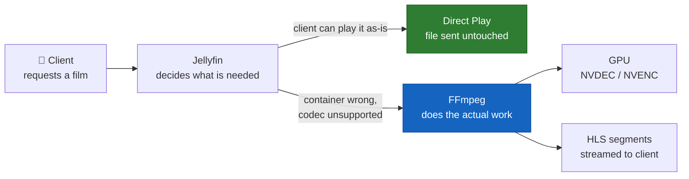

# FFmpeg — the engine underneath Jellyfin

[`TRANSCODING.md`](TRANSCODING.md) explains **when** this system transcodes and why.
This page is about the tool that actually does it: where it lives, how to read the
commands Jellyfin builds, where its logs are, and how to debug it directly when
playback fails.

Reach for this page when playback breaks and you need to know *why*, rather than
whether.

## What it is

FFmpeg is the open-source engine for decoding, encoding and converting audio/video.
Jellyfin contains no video code of its own — it decides *what* needs to happen, writes
an FFmpeg command, and runs it as a child process.



The practical consequence: **Direct Play costs nothing, transcoding costs GPU**. If
FFmpeg cannot start, every non-Direct-Play title becomes unplayable while the rest of
the library looks perfectly healthy — the exact shape of the
[2026-07-29 GPU outage](../incidents/2026-07-29-jellyfin-gpu-transcode-outage.md).

## Which build this system uses

```
/usr/lib/jellyfin-ffmpeg/ffmpeg     ffmpeg version 7.1.4-Jellyfin
```

There is **no system `ffmpeg`** in the container — only this bundled build. That is
deliberate: `jellyfin-ffmpeg` is patched with hardware-acceleration support that
distribution builds usually lack, and Jellyfin pins the version it is tested against.

Available acceleration methods in this build:

```
cuda  vaapi  qsv  drm  opencl  vulkan
```

This system uses **cuda** (NVIDIA, RTX 4080 SUPER). The others are for Intel/AMD
hardware and go unused here.

Always invoke the full path when testing. A bare `ffmpeg` will not be found:

```bash
docker exec jellyfin /usr/lib/jellyfin-ffmpeg/ffmpeg -version
```

## Reading a Jellyfin FFmpeg command

Jellyfin logs the exact command before running it, which makes it the single most
useful artefact when playback fails. They look intimidating, but the structure is
always the same:

```
ffmpeg  [hardware setup]  -i [input]  [stream mapping]  [video opts]  [filters]  [audio opts]  [output]
```

Annotated, using the command from the GPU outage:

| Fragment | Meaning |
|---|---|
| `-init_hw_device cuda=cu:0` | Open GPU device 0 and call it `cu`. **Fails first if the GPU is broken** |
| `-hwaccel cuda -hwaccel_output_format cuda` | Decode on the GPU, keep frames in GPU memory |
| `-i file:"/data/media/movies/…"` | The source file, as the *container* sees it |
| `-map 0:0 -map 0:1 -map -0:s` | Take video stream 0, audio stream 1, drop subtitles |
| `-codec:v:0 hevc_nvenc` | Encode video to HEVC **on the GPU** |
| `-preset p5` | NVENC speed/quality preset (`p1` fastest … `p7` best) |
| `-b:v 17144280 -maxrate … -bufsize …` | Target bitrate in bits/sec — here ~17 Mbps |
| `-vf "…tonemap_cuda=…"` | GPU filter converting HDR10 → SDR |
| `-codec:a:0 libfdk_aac -ac 6 -ab 640000` | Encode audio to AAC, 6 channels, 640 kbps |
| `-f hls -hls_time 3 -hls_segment_type fmp4` | Output HLS in 3-second segments |
| `/config/cache/transcodes/<id>.m3u8` | Playlist the client actually fetches |

Two things worth internalising:

- **`-c:v copy` means no re-encoding.** If you see `copy` where you expected `hevc_nvenc`,
  the video is being remuxed, not transcoded — cheap, and not a GPU problem.
- **`_nvenc` / `_cuvid` / `_cuda` suffixes mean GPU.** Their absence (`libx264`,
  `libsvtav1`) means it fell back to **CPU**, which on 4K will stutter badly. A silent
  fallback to software is a real failure mode, not just slower.

## The logs

Jellyfin writes two kinds of log into `appdata/jellyfin/log/`:

```
log_20260730.log                                    the server log
FFmpeg.Transcode-<time>_<item>_<session>.log        one per transcode
FFmpeg.DirectStream-<time>_<item>_<session>.log     one per direct stream
FFmpeg.Remux-<time>_<item>_<session>.log            one per remux
```

Each playback that touches FFmpeg produces its own file, so they accumulate quickly —
this system had 368 of them. The **filename itself is diagnostic**: a
`Transcode` log where you expected `DirectStream` means something forced a re-encode.

Find the most recent failure:

```bash
cd ~/self-host-film
ls -1t appdata/jellyfin/log/FFmpeg.Transcode-*.log | head -1 | xargs tail -30
```

Search the server log for FFmpeg failures:

```bash
docker compose logs jellyfin --tail 500 | grep -iE "ffmpeg|exited with code"
```

## Exit codes and what they mean

FFmpeg's exit code appears in the Jellyfin log as
`MediaBrowser.Common.FfmpegException: FFmpeg exited with code N`.

| Code | Usually means | Where to look |
|---|---|---|
| `0` | Success | — |
| `1` | Generic failure — bad arguments, unreadable input | Top of the transcode log |
| `187` | **Hardware init failed** — GPU unreachable | `cuInit`, `init_hw_device` lines |
| `234` | Filter graph could not be built | The `-vf` chain |
| `255` | Killed — often Jellyfin stopping playback normally | Usually harmless |

`187` is the one worth memorising on this system. It means FFmpeg never processed a
frame; it died during setup. The give-away lines look like:

```
[AVHWDeviceContext @ 0x…] cu->cuInit(0) failed
Device creation failed: -542398533.
Failed to set value 'cuda=cu:0' for option 'init_hw_device'
```

That is a **GPU passthrough problem, not a media problem** — the file is fine.
See the [postmortem](../incidents/2026-07-29-jellyfin-gpu-transcode-outage.md).

## ffprobe — inspecting a file

`ffprobe` ships alongside FFmpeg and answers "why does this file force a transcode?".

```bash
docker exec jellyfin /usr/lib/jellyfin-ffmpeg/ffprobe -v error \
  -show_entries stream=index,codec_type,codec_name,profile,width,height,pix_fmt,channels \
  -of default=noprint_wrappers=1 \
  "/data/media/movies/Interstellar (2014)/Interstellar.2014.2160p.AV1.HDR10.OPUS.5.1-UH.mkv"
```

Reading the output:

| Field | Why it matters |
|---|---|
| `codec_name=av1` | Few phones decode AV1 → forces transcode |
| `pix_fmt=yuv420p10le` | 10-bit, i.e. HDR → needs tonemapping for SDR screens |
| `width=3840 height=2160` | 4K → large, and often downscaled for mobile |
| `codec_name=opus` | Poor client support → at minimum an audio transcode |
| `codec_name=hdmv_pgs_subtitle` | Bitmap subs — burning them in forces a **full video** transcode |

Paths are the *container's* view: `/data/media/...`, not `/mnt/f/film-data/media/...`.

## Testing FFmpeg directly

The most valuable habit from the GPU outage: **test the failing operation, not the
service**. `nvidia-smi` returning a GPU name does not prove CUDA can initialise.

**Can CUDA start and can NVENC encode?** — one second, no media needed:

```bash
docker exec jellyfin /usr/lib/jellyfin-ffmpeg/ffmpeg -hide_banner -loglevel error \
  -init_hw_device cuda=cu:0 -filter_hw_device cu \
  -f lavfi -i testsrc=size=1280x720:rate=30 -t 1 \
  -c:v hevc_nvenc -preset p5 -f null -
```

Silence and exit 0 means the whole hardware path works. This is the probe that would
have caught the outage days earlier.

**Which hardware encoders exist:**

```bash
docker exec jellyfin /usr/lib/jellyfin-ffmpeg/ffmpeg -hide_banner -encoders | grep nvenc
# -> h264_nvenc, hevc_nvenc, av1_nvenc
```

**Which hardware decoders exist:**

```bash
docker exec jellyfin /usr/lib/jellyfin-ffmpeg/ffmpeg -hide_banner -decoders | grep cuvid
# -> av1_cuvid, h264_cuvid, hevc_cuvid, …
```

**Is the tonemapping filter present** (needed for every HDR→SDR playback):

```bash
docker exec jellyfin /usr/lib/jellyfin-ffmpeg/ffmpeg -hide_banner -filters | grep tonemap_cuda
```

## Transcode scratch space

In-progress HLS segments are written to `/config/cache/transcodes` inside the container
— `appdata/jellyfin/cache/transcodes` on the host, which sits on **native ext4**, not
the `/mnt/f` Windows mount. That is the right place for it: transcoding writes many
small files quickly, and the 9p mount has far higher per-operation latency.

Two related settings are currently **off** in `appdata/jellyfin/encoding.xml`, despite
having their timing values configured:

- `EnableThrottling=false` — the encoder races ahead instead of pausing once it is well
  in front of the player, burning GPU on segments nobody may watch
- `EnableSegmentDeletion=false` — segments accumulate for the whole file rather than
  rolling

Turning both on reduces GPU and disk load during playback. Neither is destructive.

## Troubleshooting quick reference

| Symptom | Likely cause | First check |
|---|---|---|
| Playback fails instantly, `exit 187` | GPU passthrough broken | `nvidia-smi` on host **and** in container — see [GPU passthrough](GPU-WSL-PASSTHROUGH.md#diagnosing-in-10-seconds) |
| Playback works but stutters, GPU idle | Fell back to **CPU** encoding | `grep -E "libx264\|libsvtav1"` in the transcode log |
| Everything transcodes that should Direct Play | Client profile, or subtitle burn-in | Filename is `Transcode` not `DirectStream` |
| Buffering on mobile, fine on Wi-Fi | Bitrate too high for the link | `-b:v` in the command; cap quality client-side |
| Transcode dir growing large | Segment deletion disabled | `EnableSegmentDeletion` in `encoding.xml` |

## See also

- [`TRANSCODING.md`](TRANSCODING.md) — when and why this system transcodes, GPU pipeline, bitrate
- [`ARCHITECTURE.md`](ARCHITECTURE.md) — how the services fit together
- [Incidents](../incidents/) — postmortems, including the FFmpeg/GPU outage
